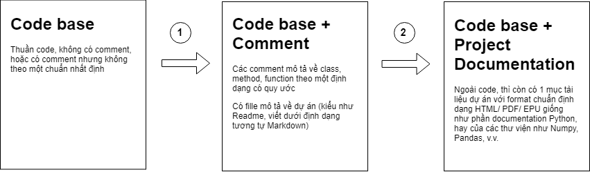

### Đặt đầu bài: 

- **Câu hỏi**: Có cách nào để tạo ra những tài liệu mô tả dự án và mô tả codebase Python (về function, method, class) trông chuyên nghiệp như các trang web documentation của Python ([link cho Python](https://docs.python.org/3/)), hay Numpy ([link cho Numpy](https://docs.scipy.org/doc/))?
- **Trả lời**: Một trong những cách để tạo project documentation  kiểu trên là sử dụng sphinx ([link](http://www.sphinx-doc.org/en/master/)), bao gồm việc comment codebase theo 1 format nhất định, rồi dùng sphinx để build documentation dựa trên các comment đó. 

### Cách thực hiện

### Câu hỏi:

- Còn các cách nào khác không? Có, như sử dụng PyDoc. Nhưng chi tiết hơn thì không rõ. 

https://romanvm.pythonanywhere.com/post/autodocumenting-your-python-code-sphinx-part-ii-6/

https://samnicholls.net/2016/06/15/how-to-sphinx-readthedocs/

https://www.sphinx-doc.org/en/master/usage/quickstart.html

http://www.sphinx-doc.org/en/master/man/sphinx-apidoc.html

https://www.sphinx-doc.org/en/master/usage/extensions/napoleon.html

https://medium.com/@eikonomega/getting-started-with-sphinx-autodoc-part-1-2cebbbca5365

https://codeandchaos.wordpress.com/2012/07/30/sphinx-autodoc-tutorial-for-dummies/

http://daouzli.com/blog/pyment.html

