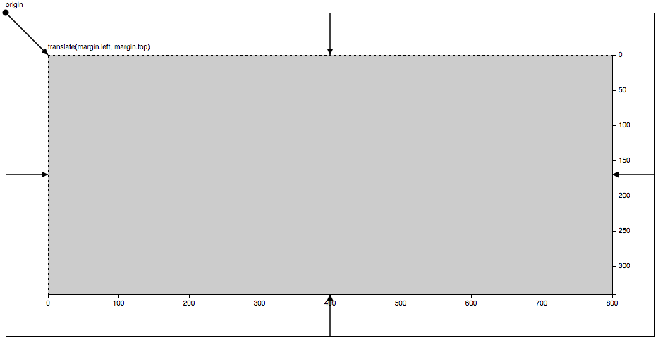
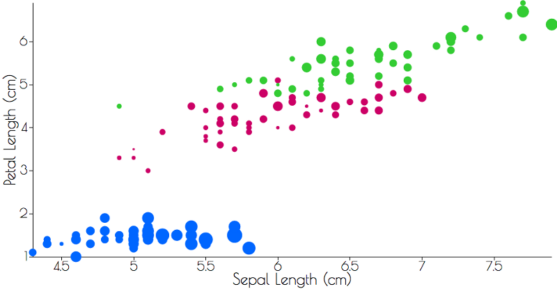
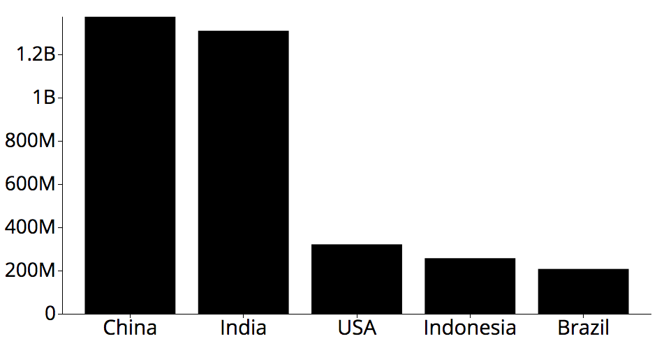
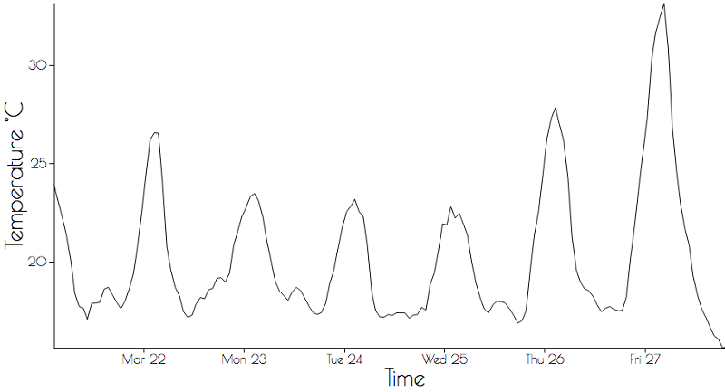
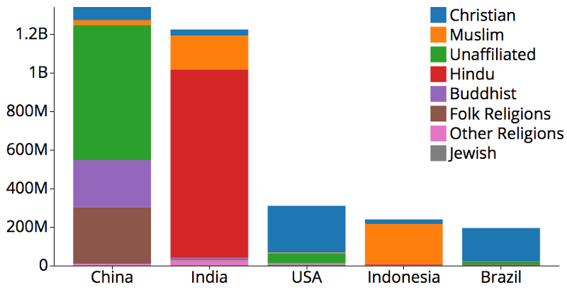
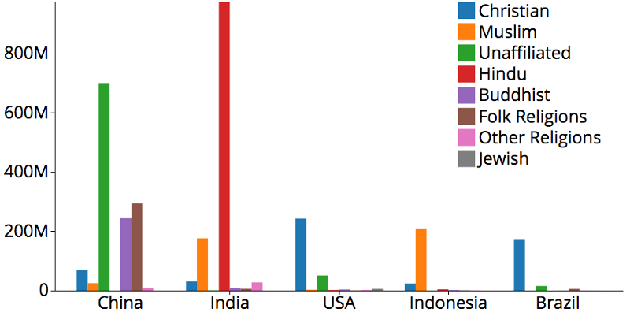
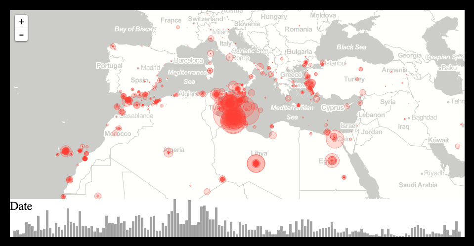
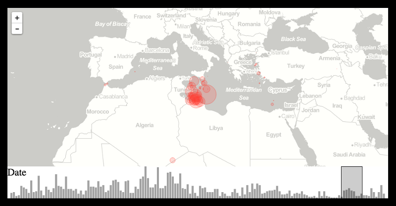
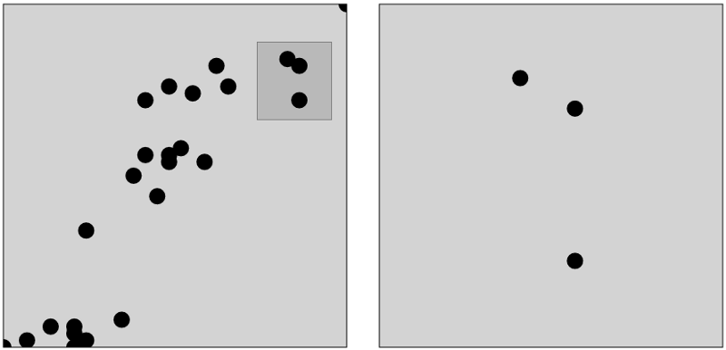
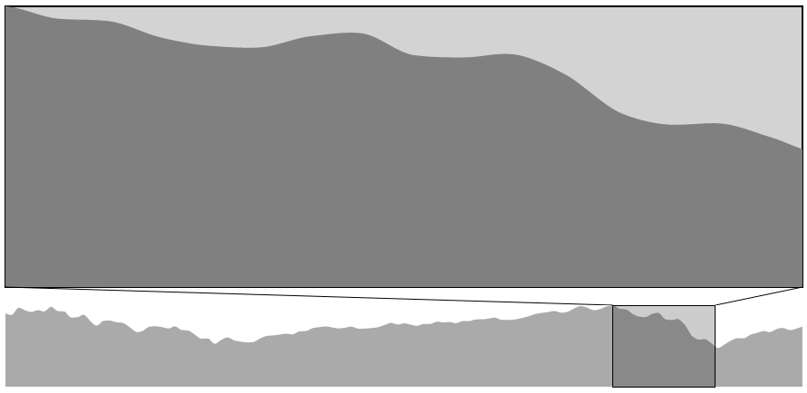

Khi ngồi viết bài này là lúc tôi vừa kết thúc phỏng vấn 1 vị trí liên quan đến **D3.js** (sáng 03.10.2017). Buổi phỏng vấn rất cởi mở, cả phía công ty (2 bác làm kỹ thuật) lẫn tôi đều cố gắng thảo luận để biết xem người được phỏng vấn (là tôi) đang ở level nào, hiểu biết đến đâu, liệu có thể làm được gì, và người phỏng vấn (công ty) đang làm gì, nhiệm vụ sắp tới ra sao, có phù hợp với ứng viên hay không. Xin được gạch đầu dòng những gì tôi rút ra được sau khoảng 30 phút nói chuyện hôm nay là:

1. Luôn luôn "*người thật việc thật*", hãy thực hành vẽ các chart nhiều nhất có thể, sửa chữa, thêm thắt thông tin, bổ sung các tương tác với người dùng. Hoặc là bạn tự viết code, hoặc là bạn copy các code mẫu về chỉnh sửa, tuỳ. Cuối cùng vẫn là cần "hiểu" mình code gì. Hiểu 100% thì chắc khó, nhưng logic flow thì buộc phải hiểu để còn giải thích và khi cần thay đổi thì biết là cần sửa code ở chỗ nào. 

2. Người phỏng vấn sẽ *chỉ hỏi những thứ cơ bản dựa trên những gì bạn làm*, không cần quá lo lắng. Bạn có thể tham khảo bài dịch dưới đây để biết cách chuẩn bị. Tuy tôi không được hỏi   những câu trong đây, nhưng tinh thần chung đều giống nhau.

3. D3.js là 1 thư viện **JavaScript**, cho nên *việc hiểu JavaScript là không thể tránh khỏi*. Tôi được hỏi một câu liên quan đến "this", một câu về "apply()", "bind()", "call()", và những tính năng mới của ES6 so với ES5. Vì thế, ngay từ lúc học JavaScript nên học cẩn thận, và chuẩn bị để trả lời những câu hỏi tương tự như trên. 

***

<h2>Về câu hỏi phỏng vấn JavaScript</h2>

Bạn có thể google sẽ nhận được rất rất nhiều gợi ý, thư viện câu hỏi và trả lời. Còn tôi, tôi sẽ sử dụng sẵn thông tin ở nhưng website hiện giờ hay vào:
- [[JavaScript is sexy] 16 JavaScript Concepts JavaScript Professionals Must Know Well][1]
- [[David Shariff blog] Preparing for a Front-End Web Development Interview in 2017][2]

<h2>Về câu hỏi phỏng vấn D3.js</h2>

Tôi cũng google thôi, kết quả không nhiêu, nhưng đủ để dùng:
- [[Curran Kelleher @ Medium] D3 Interview Questions][3] &rarr; xem bài dịch bên dưới
- [[EZDev] Top D3.Js Frequently Asked Interview Questions][4]
- [[Google Group] D3.js Interview Questions][5]

***

<h2>[Curan Kelleher] Những câu hỏi phỏng vấn về D3.js</h2>

<h3> Thông tin bài viết </h3>
- Về tác giả: [Curran Kelleher](https://medium.com/@currankelleher), Data Visualization Consultant, link [Twitter](https://twitter.com/currankelleher)
- Về bài viết: Bài gốc ở [đây](https://medium.com/@currankelleher/d3-interview-questions-4a097191b8a7), đăng ngày 26.04.2016.
- Lưu ý của người dịch: Version của D3 (v4 so với v3) không ảnh hưởng đến việc hiểu các khái niệm/ thuật ngữ trình bay bên dưới. Các thuật ngữ được in đậm, không dịch, bởi đây là thuật ngữ gốc có thể kết hợp với từ khoá "D3" để tìm kiếm tài liệu hướng dẫn kỹ thuật liên quan. 

<h3> Bài dịch </h3>

Do đã từng phỏng vấn nhiều người cho các vị trí đòi kỹ năng trực quan hoá dữ liệu (data visualization), nhất là D3.js, tôi hiểu rằng việc phỏng vấn này không dễ dàng gì. Điều này càng đúng khi người phỏng vấn không biết về D3. Do đó, tôi tập hợp lại các câu hỏi dưới đây, bôi đậm các từ khoá được kỳ vọng xuất hiện trong câu trả lời của các ứng viên. Hy vọng bài này giúp được phần nào cho các bạn làm nhân sự. 

___

**SƠ TUYỂN QUA *ĐIỆN THOẠI***

Để nhanh chóng loại những ứng cử viên không biết gì những vẫn nộp hồ sơ bừa, người phỏng vấn có thể hỏi: 

> 00 - Vị trí nào trên màn hình ứng với toạ độ (0,0)?

Câu trả lời: Trên cùng, bên trái. 
*Minh hoạ vị trí toạ độ (0,0) dưới đây, xem thêm về [Margin Convention][cap-photo01]:*

Cứ giả sử rằng họ trả lời đúng câu trên, câu tiếp theo là:

> 01 - Cách để vẽ đồ thị điểm (scatter plot) với D3?

Ứng cử viên được kỳ vọng sẽ mô tả các bước một cách khái quát, ví dụ: 
- sử dụng **linear scale** cho X, và một **linear scale** khác cho Y
- sử dụng **Margin Convention** để giới hạn các điểm chứa bên trong **phần tử "g" của SVG**  thông qua **translation**, biến **chuỗi trong CSV thành số**, 
- hiển thị các trục 
- v.v.
nếu đề cập được các bước trên nghĩa là ứng cử viên đang đi đúng hướng. Nếu họ tìm được đúng **range** của trục Y thì họ khá là ổn. Tham khảo một [ví dụ cho đồ thị điểm ở đây][6].

*Minh hoạ mở rộng với màu sắc và thay đổi kích thước của từng điểm thay vì chỉ có đồ thị (X,Y) dạng cơ bản:*

___

**PHỎNG VẤN TRỰC TIẾP**

Thế là ứng viên đã vượt qua vòng phỏng vấn sơ loại qua điện thoại, và bạn gặp cậu/ cô ấy tại văn phòng của mình. Bạn có thể sử dụng các câu hỏi trên, nhưng thay vì yêu cầu vẽ đồ thị điểm, hãy yêu cầu vẽ đồ thị dạng thanh (bar chart).

> 02 - Cách để vẽ đồ thị dạng thanh (bar chart) với D3?

Ứng viên nên trả lời ngay rằng họ sẽ sử dụng **ordinal scale** và **range bands**. Nếu tốt hơn nữa họ sẽ đề cập đến đồ thị thanh với trục Y xuất phát từ dưới hướng lên trên, và cách để tính **độ cao (height)** cũng như giá trị **y** của từng thanh. Tham khảo một [ví dụ cho đồ thị dạng thanh ở đây][7].

*Minh hoạ đồ thị dạng thanh hiển thị top 5 nước đông dân nhất thế giới năm 2010:*

Tiếp theo, hãy hỏi họ với đồ thị dạng đường (line chart). 

> 03 - Cách vẽ đồ thị dạng đường (line chart) với D3?

Ứng viên cần biết rằng đường thẳng là **phần tử "path" của SVG**, và thuộc tính **d** cần được thiết lập thông qua [**d3.svg.line**][8]. Tham khảo một [ví dụ cho đồ thị dạng đường ở đây][9].

*Minh hoạ đồ thị hiển thị nhiệt độ của thành phố San Francisco trong 6 ngày liên tiếp:*

Viết code để vẽ đồ thị thanh dạng nhóm (stacked hoặc grouped bar chart) tương đối khó. Mặc dù vậy, câu hỏi về đồ thị dạng này có thể dự phòng cho những ứng cử viên đã trả lời được hết những câu hỏi trên. 

> 04 - Cách vẽ đồ thị thanh dạng nhóm (stacked hoặc grouped bar) với D3?

Ứng cử viên tối thiểu cần nhắc đến việc dùng **d3.layout.stack**. Nếu họ đề cập **d3.nest** và **nested selections** thì có nghĩa là họ biế chính xác mình đang nói về cái gì. , then they really know what they are talking about. Tham khảo một [ví dụ cho đồ thị Stacked Bar Chart ở đây][10] hoặc [đồ thị Grouped Bar Chart ở đây][11].

*"Đồ thị thể hiện các tôn giáo tại 5 nước đông dân nhất thế giới năm 2010:*

*Để ý việc so sánh trở nên dễ dàng hơn khi các nhóm được đặt cạnh nhau:*

Một điểm nữa là hỏi về cách bổ sung tính năng tương tác với đồ thị. 

> 05 - Có những cách nào để giúp người dùng tương tác với đồ thị?

Câu trả lời có thể là **tool tips** (thông tin chi tiết được hiện ra khi đưa chuột lên đồ thị), là **brushing** (khả năng chọn vùng hiển thị thông qua việc kéo - thả chuột), là **panning** và **zooming**. Một khi đã có tương tác, thì các **views** có thể được liên kết với nhau tạo thành **linked views**. 

> 06 - Làm thế nào để tạo nhiều đồ thị (multiple chart) cùng 1 lúc?

Đối với đề tài này, dấu hiệu tốt là khi ứng viên nhắc đến [**Crossfilter**][12] và [**Reusable Charts Pattern**][13]. **Linked views** sẽ được tương tác thông qua **filtering**, nơi mà ta thay đổi **view** số 1 với **brushing** hoặc **picking** thì **view** số 2, 3, v.v cũng thay đổi theo.

[*Biểu đồ tần số kết hợp với bản đồ để thể hiện tỷ lệ chết theo thời gian*][cap-photo07]:

*Một ví dụ của "linked views", trong đó sử dụng "brushing" đối với biểu đồ tần số để lọc dữ liệu trên bản đồ:*

Ngoài ra còn có thể sử dụng **Focus** và **Context** để cho hiệu ứng tương tự.

[*Minh hoạ Focus + Context với brushing cho đồ thị dạng điểm:*][cap-photo09]

[*Minh hoạ Focus + Context với brushing cho đồ thị dạng vùng:*][cap-photo10]

___

Nếu người phỏng vấn là một kỹ sư, ngoài các câu hỏi trên, các vấn đề không liên quan trực tiếp đến D3 cũng có thể sử dụng để kiểm tra ứng viên như:

- Viết một hàm nhận file CSV, trả về một chuỗi chứa các objects. Keys là tên cột, values là chuỗi. 
...- Biến dữ liệu (cái nào cần thiết) từ dạng chuỗi thành số.
...- Xử lý các dấu ngoặc kéo "" trong chuỗi. 

- Viết một hàm tính histogram của một chuỗi. Điều gì sẽ xảy ra nếu tính cả giá trị lớn nhất?

Lưu ý: Ai cần học những kiến thức trên có thể tham khảo [series video "D3 101" tại đây][14].

[1]: http://javascriptissexy.com/16-javascript-concepts-you-must-know-well/
[2]: http://davidshariff.com/blog/preparing-for-a-front-end-web-development-interview-in-
[3]: https://medium.com/@currankelleher/d3-interview-questions-4a097191b8a7
[4]: http://www.ezdev.org/view/d3js/6540
[5]: https://groups.google.com/forum/#!topic/d3-js/a0zl0G6xCRg
[6]: http://bl.ocks.org/curran/134ed87c99257e3f2e31
[7]: http://bl.ocks.org/curran/6cd1e224d76811b68df4
[8]: https://github.com/mbostock/d3/wiki/SVG-Shapes#path-data-generators
[9]: http://bl.ocks.org/curran/60b40877ef898f19aeb8 
[10]: http://bl.ocks.org/curran/805413fb3b2efaada1ce
[11]: http://bl.ocks.org/curran/d4e2b2854f25429a06aa
[12]: http://square.github.io/crossfilter/
[13]: https://bost.ocks.org/mike/chart/
[14]: https://github.com/curran/screencasts#d3-101

[cap-photo01]: https://bl.ocks.org/mbostock/3019563

[cap-photo07]: https://bl.ocks.org/curran/a479b91bba14d633487e

[cap-photo09]: http://bl.ocks.org/curran/d1e9ea2850047562be09

[cap-photo10]: http://bl.ocks.org/curran/d5252d37917ab6eab032
