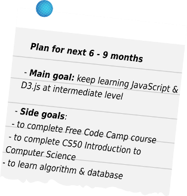

Vậy là sau 2 tháng học front-end development ở Techmaster Vietnam, tôi đã được 1 công ty phần mềm ở Hà Nội nhận vào làm việc ở vị trí *Kỹ sư phần mềm* bắt đầu từ giữa tháng 10 năm 2017. Dù việc này là kết quả của nhiều yếu tố (trong đó có may mắn), nó vẫn làm tôi hạnh phúc suốt mấy ngày liền. Với một người từng học ngành điện, ra trường với bằng *Kỹ sư Điện*, đi làm bao năm gắn với ngành năng lượng và sản xuất, thì được mang trên mình một "professional title" mới là cả một sự tự hào vì những nỗ lực của bản thân trong thời gian ngắn ngủi vừa qua. Ngày mai (16.10.2017) sẽ là ngày đầu tiên tại công ty mới, một trang mới của cuộc đời lại được lật. Tranh thủ một buổi tối mùa thu Chủ nhật bình yên, tôi kiểm tra lại "hành lý" xem mình đã có gì, cần sắp xếp gọn gàng hay vứt đi những thứ gì để có 1 "vali" gọn gàng nhất trước khi bước vào "chuyến tàu mới" ngày mai. 

Hành lý của tôi mấy tháng vừa rồi có gì?
- Một dãy dài các khoá học còn dang dở ít hoặc nhiều
- Một danh sách bookmark gần 150 mục các bài viết "lưu lại để nghiên cứu"
- Một danh sách Evernote gần 250 mục các bài viết "lưu lại để nghiên cứu, để dịch" 
- Hơn 100 trang viết tay trong sổ A4 những ghi chú trong quá trình học ở Techmaster. 
- Một kế hoạch 39 tháng tính từ 01.08.2017 (lúc tôi nghỉ việc cũ và chuyển sang học lập trình)

Đống hành lý này như mớ giấy tờ, quần áo, đồ đạc vô cùng lộn xộn. Có thứ dùng rồi, có thứ mới tinh, có thứ dặn mình cần đọc lại mà sau lại quên. Tôi lướt qua và nhẩm thấy là:
- Khoảng 60% ~ 70% các khoá học online của tôi đều dang dở (tức là mới hoàn thành được dưới 70% lộ trình).
- Rất nhiều bookmark không được cho vào các mục một cách khoa học, phải 50% bookmark có thể xoá bởi nó không phải thứ không thể tìm thấy sau khi google. 
- Rất nhiều note trong Evernote cũng cần được sắp xếp và xoá đi giống như bookmark.
- Hơn 100 trang viết tay cần được đánh số trang, tô đậm các chủ đề, và toàn bộ từ khoá của từng chủ đề cần được tạo đề mục trong trang đầu tiên để dễ dàng tra cứu sau này. 
- Kế hoạch 39 tháng kia sẽ được xem lại và điều chỉnh khi kết thúc năm 2017 (dương lịch).

Sau một hồi xoá, viết, xoá, viết, chiếc vali bừa bộn ban đầu giờ đã ngăn nắp hơn rất nhiều. Tôi biết cơ bản là mình đã đọc những chủ đề gì, từng ngây thơ ở những chỗ nào, từng ép mình học một cách phi thực tế những khoá học nào bên cạnh 1 chương trình vốn đã nặng của Techmaster. Tôi nhét vào vali một tờ ghi chú "**Kế hoạch học tập cho 6 ~ 9 tháng tiếp theo**", tự lên 1 "**budget cho các học liệu và khoá học trả phí**" cho năm 2017 (khoảng 50% của 1 tháng lương), cũng như chốt lại **danh sách bài viết hướng dẫn về lộ trình học** để có thể thường xuyên kiểm tra và nhắc nhở bản thân mình. 

Chuyến tàu mang tên "*lập trình viên tương lai*" của tôi mới bắt đầu từ ga số 0, còn quá nhiều chặng đường cần phải đi qua những tháng năm tới. Mùa thu đã sang, những cơn gió heo manh đã manh nha xuất hiện vào 1 buổi sáng nắng hanh ở Hà Nội khiến cho lòng tôi trùng lại rất nhiều. Đã qua một mùa hè căng thẳng nhưng tràn ngập năng lượng ở Techmaster, tôi chợt thấy cuộc đời ngắn ngủi quá, còn biết bao nhiêu mùa ùa thu, mùa đông để mình được làm những điều mình yêu thích, ở bên những người mình yêu thương, và lòng đầy nhiệt huyết của tuổi trẻ chưa bao giờ nguôi...