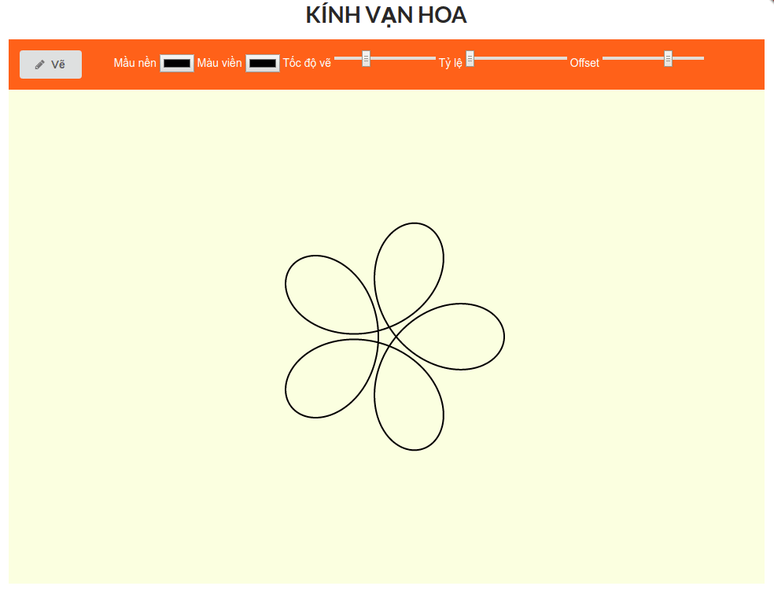
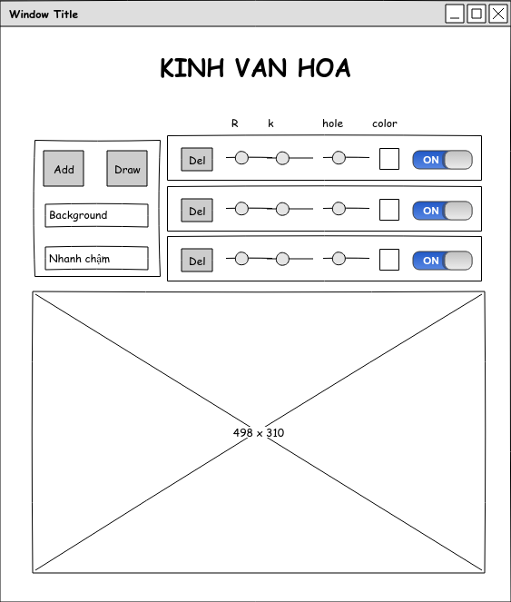

## Giới thiệu

- Tên tiếng Việt: Thước vạn hoa (phiên bản đơn giản)
- Mục đích: 
    - Học React: các khái niệm cơ bản như component, state, props, component lifecycle, phần styling cho component, sử dụng create-react-app, cũng như cách deploy lên Github Pages. 
    - Giúp vẽ các spirograph tương tự ở [đây](https://kipalog.com/posts/Ve-Spirograph-bang-D3-js)
- Chức năng: Vẽ siprograph dựa vào các tham số như: (1) Màu nền, (2) màu viền, (3) tỷ lệ R/r, (4) Offset Hole, và (5) Thời gian vẽ
- Trình duyệt hỗ trợ: Chrome
- Link sản phẩm ở đây: http://travisnguyen.net/react-draw-spirograph/
- Minh họa:



## Phác thảo giao diện

Ghi chú: Phần dưới đây đã không đúng với bản code thực sự nữa. Lý do thay đổi là phần này phức tạp hơn dự tính ban đầu, đi chệch hướng khỏi mục đích cao nhất là học các khái niệm cơ bản của React thật nhanh. 



- Ô số 1 (bên trái)
    - Nút "Draw" để vẽ
    - Ô "Background" là picker để chọn màu nền
    - Ô "Nhanh chậm" là toggle để chuyển chế độ vẽ Nhanh/ Chậm (Mặc định)
- Ô số 2 (bên phải):
    - Dòng đầu text trên cùng: Ứng với R, k, offset hole, và color
    - Các component bên dưới chứa:
        - Nút "Del" để xóa 
        - Picker dạng scale chọn R, k, offset hole
        - Color picker chọn màu của sipograph
        - Toggle ON/OFF để ẩn/ hiện sipograph.
- Ô to nhất dưới cùng: Chứa ảnh SVG

## Phân tích bản phác thảo dưới góc nhìn React

Các bước phân tích được dựa theo bài [Thinking in React](https://reactjs.org/docs/thinking-in-react.html).

### Danh sách Component

- Component `App`: Chứa toàn bộ các component con
- Component `MenuMain`: chứa nút Vẽ, các input về `backgroundColor`, `color`, `ratio`, `offsetHoleDistance`, và `animationDuration`. 
- Component `Drawing`: chứa thẻ `svg`
- Component `Spirograph`: chứa method để vẽ, thay đổi thẻ `svg`. 

```javascript
    App
    |
    |------MenuMain
    |
    |------Drawing
             |
             |-----Spirograph
```

### Data Model

### Thư viện bên ngoài: 

- Semantic-UI cho phần Style. Link: https://semantic-ui.com. Lý do dùng thư viện CSS này? Không có lý do đặc biệt. Cảm thấy ngôn ngữ này lạ, mọi thứ viết hết vào tên class rất gần với ngôn ngữ người. 

- [D3.js](https://d3js.org/) để vẽ spirograph. Đây là vấn đề cần lưu tâm bởi hiện tại chưa có một cách thống nhất cách dùng d3.js với ReactJs. 

### Xây dựng một phiên bản React tĩnh

Bước này bị bỏ qua. Chỉ có 1 file html tĩnh được viết sử dụng style của Semantic-UI. 

### Xác định xem component nào có state

Với bài toán hiện tại, dữ liệu duy nhất cần có chính là thông tin cấu hình của mỗi spirograph, là 1 object chứa các properties:
- Màu nền (backgroundColor)
- Màu viền (color)
- ratio (tỷ lệ R/r)
- offsetHoleDistance
- animationDuration

Dữ liệu này cần được truyền từ component `MenuMain` đến componet `App`, rồi từ `App` truyền cho component `Drawing`. 

Với 3 câu hỏi của React.js, ta thấy:
1. Dữ liệu này có được truyền từ 1 component cha thông qua props? Không đúng, bởi nó được truyền từ con là `MenuMain` đến cha `App`. 
2. Dữ liệu này có bất biến theo thwofi gian? Không đúng, nó thay đổi theo input của người dùng. 
3. Nó có thể được tính dựa trên state hoặc props khác? Không.

Vậy rõ ràng, dữ liệu trên là "state". 

### Xác định nơi State thuộc về component nào

Dữ liệu chứa cấu hình của spiprograph sẽ là state của component `App`. 

### Luồng dữ liệu ngược

Do dữ liệu trên đi ngược từ component `MenuMain` đến component `App`, ta cần khai báo 1 hàm callback là:

```js
changeGeneralConfig(generalConfig) {
    this.setState(generalConfig);
}
```

Bind hàm `changeGeneralConfig()` này với `this` của `App` thông qua `constructor`.

Sau đó truyền vào cho `MenuMain`:
```js
<MenuMain onGeneralConfigChange={this.changeGeneralConfig}/>
```
Tại `MenuMain`, truyền hàm này vào bên trong `onClick()`, mỗi lần bấm nút thì dữ liệu sẽ được truyền ngược về cho `App`. 

```js
<button
    onClick={() => this.props.onGeneralConfigChange(newConfig)} >
</button>
```

### Xác định các method lifeCycle của component Spirograph

Component `Spirograph` chứa những method để vẽ spirograph. Các method này dựa vào cấu hình truyền vào để tạo ra các element con rồi đính vào element `svg` đã có sẵn. Bên trong component `Spirograph` chứa 2 lifeCycle method:

1. componentDidMount:
- Mục đích: ngay sau khi component `Spirograph` này được mount, thì method `componentDidMount` sẽ chạy và tạo ra nội dung cho `svg` như đã nói ở trên. Người dùng không cần click vào nút vẽ, mà chỉ cần khởi động trang đã có 1 hình vẽ sẵn ở đó. 
- sử dụng `this.props`.

2. shouldComponentUpdate(nextProps, nextState)
- Mục đích: để khi `App` props mới cho `Drawing`, `Drawing` cho `Spirograph`, thì phần svg mới sẽ được render lại. Người dùng sẽ có hình mới dựa trên thông số nhập vào. 

```js
shouldComponentUpdate(nextProps, nextState) {
    this.createSpirograph(nextProps);
    return true;
}
```
### Cách deploy lên Github Pages

Để deploy lên Github Pages, làm theo các hướng dẫn ở [đây](https://github.com/facebook/create-react-app/blob/master/packages/react-scripts/template/README.md#github-pages)

## Kết luận

- Đã có những hình dung cơ bản về props, state, cách viết components, cách truyền dữ liệu qua lại, cách style trong React.
- Sử dụng create-react-app và deploy lên Github Page.
- Cần cải tiến thêm:
    - Bổ sung responsive
    - Thêm tính năng thêm graph
    - Kiểm tra tương thích với IE 9, 10, 11