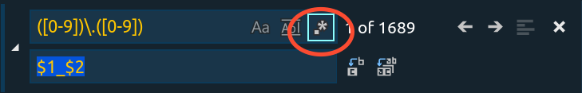

### Bài toán:

Cần sửa dấu "`.`" thành "`_`" trong file JSON khi mở bằng `vs code`, cụ thể là sửa khoảng 200 mẩu tương tự như đoạn code dưới đây. Không sửa thủ công được, và dấu "`.`" cần sửa là dấu nằm kẹp giữa 2 ký tự số (từ 0 đến 9).
```
    {
        "from": "01400551.20180408164046001",
        "id": "l-2",
        "to": "N1702006899521938233"
    }
```
### Thực hiện:

Tham khảo từ bài [này trên Stackoverflow](https://stackoverflow.com/questions/42179046/what-flavor-of-regex-does-visual-studio-code-use/42184299#42184299)

- Bước 1: Nhấn tổ hợp `Ctrl` + `H`, chọn vào biểu tượng dấu `.*` ở góc như khoanh đỏ. 



- Bước 2: Điền vào Search:  `([0-9])\.([0-9])`
- Bước 3: Điền vào Replace: Điền  `$1_$2`
- Bước 4: Chạy đoạn Find and Replace này.

Đoạn regular expression trên có nghĩa là:
- Phần `([0-9])` để tìm ký tự từ 0 đến 9, và cho nó vào 1 nhóm, ghi nhớ tên nhóm (chính là nhờ ký tự `( )`). Do kết quả search ra 2 nhóm, ứng với 02 ký tự trước và sau dấu `.`, ta gán 2 nhóm đấy lần lượt vào 1 thuộc tính (được định nghĩa trước) của object RegExp là `$1` và `$2`.  Đọc về phần nhóm ở [đây](https://developer.mozilla.org/en-US/docs/Web/JavaScript/Reference/Global_Objects/RegExp#grouping-back-references) và phần thuộc tính định nghĩa trước của object RegExp ở [đây](https://developer.mozilla.org/en-US/docs/Web/JavaScript/Reference/Global_Objects/RegExp/n).
- Phần replace, thực chất là chạy method `repace()` của object RegExp (xem ở [đây](https://developer.mozilla.org/en-US/docs/Web/JavaScript/Reference/Global_Objects/RegExp/@@replace)), cụ thể là giữ nguyên nhóm 1 và nhóm 2 (ứng với `$1` và `$2`, chỉ thay thế dấu `.` bị kẹp giữa được tìm thấy bằng dấu `_`

ngminhtrung 09-04-2018
