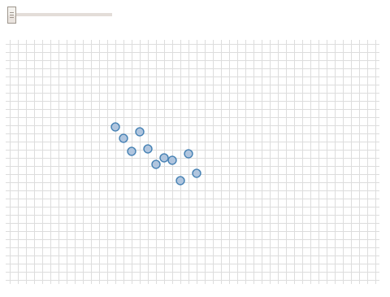

Khi vẽ bằng D3.js, có rất nhiều lúc ta có nhu cầu phóng to, hoặc thu nhỏ một vùng nào đấy để nhìn rõ hơn các chi tiết. Tính năng này được D3.js cung cấp đầy đủ qua tập hợp các API của [Zooming (d3-zoom)](https://github.com/d3/d3-zoom/blob/master/README.md#zoom). Tập API này giúp phóng to thu nhỏ các phần tử SVG, HTML hoặc Canvas khi người dùng tương tác bằng chuột hoặc cảm ứng.

Bài viết bên dưới đây:
- sẽ demo một biểu đồ chứa các node hình tròn, và cách ta có thể dùng D3.js để phóng to/ thu nhỏ các node này.
- sẽ chỉ tập trung vào logic flow khi làm việc với zoom của D3js. 
- không đi sâu vào việc tạo svg, các node hình tròn, import data từ bên ngoài, v.v.
- toàn bộ code demo có thể xem tại [bl.ocks.org](https://bl.ocks.org/ngminhtrung/7c5721a1504f3e29a36da9ddd9e5039b).



### Khởi tạo tính năng phóng to thu nhỏ

Việc khởi tạo sẽ thông qua `d3.zoom()`: 
- Method này sẽ khởi tạo "tính năng" phóng to thu nhỏ (tác giả Mike Bostock gọi nó là "behavior"), gọi tắt là "zoom".
- Tính năng này rất thú vị, nó vừa là 1 object, vừa là 1 function. Khi muốn trang bị tính năng zoom cho 1 phần tử nào đó, tạm gọi phần tử này là "selection", thì ta sẽ sử dụng cú pháp `selection.call(zoom)`.

Hãy xem đoạn code bên dưới:

```javascript
var zoom = d3.zoom() /* khởi tạo tính năng zoom. 
                    Nó vừa là object, vừa là function */

var svg = d3.select("body").append("svg")
            .call(zoom); /* Phần tử svg được áp dụng tính năng zoom
``` 

Một khi phần tử `svg` được áp dụng tính năng zoom, những đặc tính chi tiết hơn của zoom cũng sẽ được trang bị cho `svg`. 

### Chi tiết hóa tính năng phóng to thu nhỏ      

Khởi tạo chưa đủ, ta còn cần chỉ rõ cho D3.js những chi tiết ta cần ở tính năng này. Hãy đọc đoạn code đi kèm comment bên dưới đây:

```javascript
var zoom = d3.zoom()
    .scaleExtent([1, 10]) /* Phóng to từ 1 đến 10 lần kích thước ban đầu */
    .on("zoom", zoomed); /* Thiết lập event listener
    tức là "lắng nghe" mỗi khi có sự kiện zoom (phóng to, thu nhỏ)
    thì chương trình sẽ gọi method "zoomed" để xử lý */
```

Sự kiện "event" là 1 object, nó chứa thuộc tính "transform".
- Thuộc tính này cho ta biết là người dùng đang muốn phóng to, hoặc thu nhỏ bao nhiêu lần. 
- Việc này thông qua hành vi như vuốt touchpad, lăn chuột giữa, hoặc kéo thanh slider, v.v. 
- Khi truyền giá trị của thuộc tính "transform" này cho chính thuộc tính "transform" của 1 vùng cần tương tác, thì ta sẽ khiến vùng đấy cũng được phóng to lên, hoặc thu nhỏ lại 1 tỷ lệ tương ứng. 
- Trong ví dụ bên dưới, ta chọn vùng "container", vốn là phần có background kẻ ô ly, một vùng bên trong `svg`.
- Thuộc tính "transform" có thể tìm hiểu thêm ở trang Mozilla MDN web docs, bài [này](https://developer.mozilla.org/en-US/docs/Web/SVG/Attribute/transform).

```javascript
function zoomed() {
    /* method "zoomed" được gọi để thực thi mỗi khi có sự kiện zoom ở đâu đó */
    const currentTransform = d3.event.transform;
    container.attr("transform", currentTransform);
}
```

### Làm thế nào để biết là người dùng đang phóng to, thu nhỏ?

Bản thân `d3-zoom` đã tích hợp sẵn khả năng nhận biết sự kiện (event) vuốt touchpad, lăn chuột giữa. Và ở bài này, ta có nhu cầu là thêm **slider**, một thanh kéo lên kéo xuống vô cùng trực quan để người dùng tiện thao tác. Cứ kéo 1 phát, bất kể chiều nào, là 1 event mới được sinh ra.

Để triển khai chi tiết này, ta cần:
- Bổ sung HTML element `<input>`, với đủ các attributes từ `type`, `value`, `min`, `max`, `step`. Giá trị truyền vào cho các attributes này minh họa qua đoạn code dưới. 

    ```javascript
    var slider = d3.select("body").append("p").append("input")
        .datum({})
        .attr("type", "range")
        .attr("value", zoom.scaleExtent()[0])
        .attr("min", zoom.scaleExtent()[0])
        .attr("max", zoom.scaleExtent()[1])
        .attr("step", (zoom.scaleExtent()[1] - zoom.scaleExtent()[0]) / 100)
    ```
- Ngoài ra, mỗi khi thanh slider được kéo, thì event listener "input" của nó kích hoạt hàm `slided()`. Hàm này gọi `zoom`, yêu cầu phóng vùng được chọn (ở đây là `container`) đến 1 tỷ lệ ứng với attribute `value` của slider (ở dưới đây ứng với `d3.select(this).property("value")`)
    ```javascript
    function slided(d) {
        zoom.scaleTo(container, d3.select(this).property("value"));
    }

    slider.on("input", slided);
    ```

Đến đây là ta đã tạm xong những thứ cơ bản cho zoom. Những thứ khác sẽ không bàn trong phạm vi bài này.

### Kết luận

Các API của mục Zooming còn rất nhiều để người dùng (lập trình viên thỏa sức sáng tạo). Ngoài việc dùng Zooming, ta còn có thể kết hợp với phần Kéo thả (Drag) của D3 để tạo ra những biểu đồ tương tác sinh động nhất với người dùng.