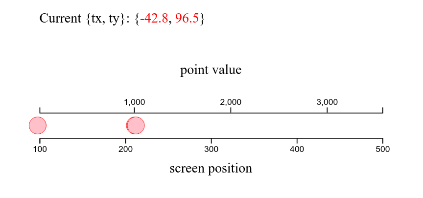
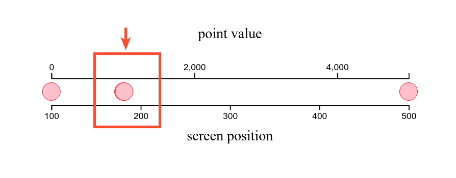
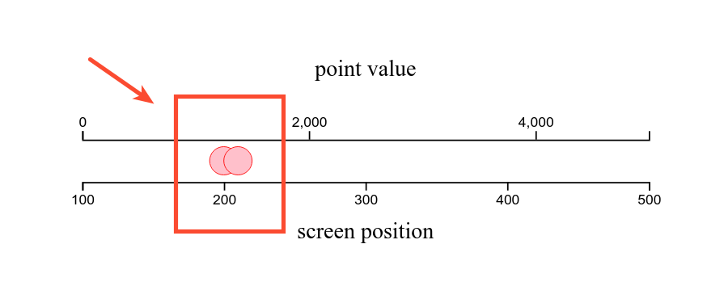
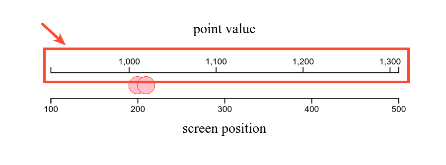
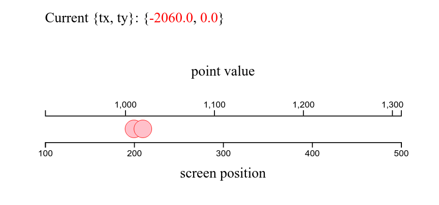

### Mở đầu

Trong bài [Sử dụng D3.js để phóng to thu nhỏ SVG](https://travisnguyen.net/D3js/2018/04/23/d3js-drag-zoom-slider/), tôi đã có bước đầu tiếp cận d3-zoom ở mức độ tổng quan. Ở bài này, phần trình bày của Peter Kerpedjiev (một Postdoctoral Fellow tại Hardvard Medical School) trong [Empty Pipes - Panning and Zooming with D3v4](http://emptypipes.org/2016/07/03/d3-panning-and-zooming/) sẽ được dịch lại. Peter phân tích về d3-zoom ở mức độ chi tiết hơn, sử dụng ví dụ vừa trực quan, vừa được nâng dần độ phức tạp để người đọc kịp theo dõi. Kiến thức trình bày ở đây vừa trùng lặp, vừa nâng cao so với bài trước. Cho nên ăn may mà có thể coi đây là 2 bài trong 1 series về d3-zoom được.



Link xem demo tại [bl.ocks.org](https://bl.ocks.org/ngminhtrung/6c354a3d5075f41fa7db51b896d1595a)

Về thuật ngữ:
- **panning**: nghĩa là việc di đối tượng sang trái phải, lên trên, xuống dưới. Thường việc di này thực hiện nhờ giữ chuột trái lên vùng hiển thị, kéo qua kéo lại (đối với máy tính).
- **zooming**: là việc thu phóng đối tượng. Việc này hoặc nhờ cuộn thanh giữa của chuột, hoặc là dùng 2 ngón tay đồng thời miết trên màn hình điện thoại.
- **plot**: tạm gọi phần `svg` được tạo ra là "bản vẽ".

Để thực hiện panning và zooming thông qua D3.js, về lý thuyết, tất cả những thứ cần biết là:
- phép dịch đối tượng theo trục X và trục Y một khoảng **t<sub>x</sub>** và **t<sub>y</sub>**. Viết tiếng Anh chính là **translation [t<sub>x</sub>, t<sub>y</sub>]**.
- tỷ số thu phóng **k**. Viết tiếng Anh chính là *scale factor* **k**.
- Khi ta phóng to, thu nhỏ một đối tượng, ta đang làm biến đổi đối tượng đấy, trong D3.js gọi hành động này là một "**zoom transform**". Đại diện cho hành động này là object **transform**.
- Nếu đối tượng có vị trí ban đầu là **[x<sub>0</sub>, y<sub>0</sub>]**, thì sau khi bị biến đổi, nó có vị trí mới là **[t<sub>x</sub> + k ✖️ x<sub>0</sub>, t<sub>y</sub> + k ✖️ y<sub>0</sub>]**.
- Đơn giản vậy thôi, những thao tác còn lại chỉ là thêm mắm thêm muối cho 4 gạch đầu dòng cơ bản bên trên.

Để minh họa kỹ thuật panning và zooming trong **D3 v4**, ta sẽ lấy ví dụ vẽ 4 hình tròn tương ứng với 1 mảng của `[1, 1010, 1020, 5000]`. Tất tật chỉ cần minh họa trong 1 chiều (trục X), không cần dùng đến trục thứ 2 (gây rối mắt).

### Bước 1: Vẽ đối tượng

```javascript
    const xScale = d3.scaleLinear()
        .domain([0,5000])
        .range([100,500])

    const dataPoints = [1, 1010, 1020, 5000];

    gMain.selectAll('circle')
    .data(dataPoints)
    .enter()
    .append('circle')
    .attr('r', 7)
    .attr('cx', function(d) { return xScale(d); });
```


Nhìn vào ảnh, ta thấy 2 hình tròn ứng với 2 điểm 1010 và 1020 đang nằm đè lên nhau, lệch nhau 1 chút. Sử dụng hàm `xScale()` để tính tọa độ x của 2 điểm trên, ta nhận được kết quả bên dưới đây. Tính ra khoảng cách giữa 2 tâm của 2 đường tròn chỉ là 0.8 pixel, rất nhỏ để phân biệt được chúng.

```javascript
xScale(1010) //180.8
xScale(1020) //181.6
// 181.6 - 180.8 = 0.8
```

### Bước 2: Tăng khoảng cách giữa 2 đường tròn đang dính vào nhau 

Giả sử ta muốn 2 đường tròn kia xa nhau 10 pixels chứ không phải 0.8 pixel? Tức là phải tính một tỷ số phóng đại (scale factor) **k** bằng 12.5.

```javascript
var k = 10 / 0.8  // 12.5 
```

Giả sử thêm là sau khi phóng lên, thì đường tròn của điểm 1010 sẽ nằm tại tọa độ 200 (vẫn là trục x). Áp dụng phần cơ bản trong 4 gạch đầu dòng nói trên:
- Tọa độ ban đầu của x<sub>0</sub> của đường tròn là `xScale(10101)` bằng 180.8
- Tỷ số phóng đại k = 12.5
- Sau khi phóng, đường tròn 1010 di chuyển đến toạn độ mới bằng 200
- Phương trình cân bằng là: *200 = t<sub>x</sub> + k ✖️ x<sub>0</sub>*.
- Vậy khoảng dịch trục x (translation [tx]) sẽ là: - 2600
```javascript
var tx = 200 - k * xScale(1010) // = 200 - 12.5 * 180.8 = -2600
```

Từ đây, áp dụng vào bản vẽ ban đầu:

```javascript
var k = 10 / (xScale(1020) - xScale(1010))
var tx = 200 - k * xScale(1010)
var t = d3.zoomIdentity.translate(tx, 0).scale(k)

gMain.selectAll('circle')
.data(dataPoints)
.enter()
.append('circle')
.attr('r', 7)
.attr('cx', function(d) { return t.applyX(xScale(d)); });
```

thu được kết quả là 2 hình tròn của 1010 và 1020 đã không còn dính vào nhau nữa:



Đoạn code trên có 2 chỗ mới:
- `d3.zoomIdentity`: Đây thực chất là 1 transform có k=1, t<sub>x</sub> = t<sub>y</sub> = 0. Có thể coi là 1 transform zero, không thu phóng, không dịch chuyển. Mục đích chỉ là tạo ra object transform nguyên thủy, sau đấy bổ sung thêm *translation* mới (ứng với `translate(tx, 0)`), và thêm tỷ số thu phóng (`scale(k)`).
- `t.applyX(xScale(d))`, `t` lúc này đã là 1 object "transform" rồi, cho nên:
    - Về bản chất, công thức trên áp dụng `transform.applyX(x)` sẽ tính ra phép dịch trục X 1 khoảng là: x ✖️ k + t<sub>x</sub>
    - Ở đây, x = xScale(d), cho nên đầy đủ phép tính là: xScale(d) ✖️ k + t<sub>x</sub>.
    - Kết quả là tọa độ trục X của từng đường tròn sẽ được dịch ra 1 vị trí mới. Vị trí ban đầu là xScale(d), giờ thêm 1 quãng xScale(d) ✖️ (k - 1) + t<sub>x</sub>.

### Bước 3: Dãn trục X nằm phía trên đường tròn theo đúng tỷ lệ thu phóng vừa áp dụng

Ở trên ta đã dãn các đường tròn ra 1 đoạn, nhưng trục X nằm phía trên đường tròn (gọi là **gTopAxis**) vẫn đang bị giữ cố định (không đụng vào trục X bên dưới, nó tượng trưng cho số pixel của trục X).

Việc dãn *gTopAxis* được thực hiện thông qua việc tính lại *xScale* truyền vào cho *xTopAxis*. 

```javascript
const xNewScale = t.rescaleX(xScale)

const xTopAxis = d3.axisTop()
    .scale(xNewScale)
    .ticks(3)
```

Method `rescaleX()` của `t` (một object "transform) nhằm mục đích tạo lại scale mới dựa trên xScale (cũ) mà thôi. Method này tính toán tương đối lằng nhằng. Tạm thời chỉ cần hiểu như thế.

Kết quả ta được cả phần trục X *gTopAxis* lẫn các đường tròn được dãn đồng bộ với nhau.



### Bước 4: Tích hợp sự kiện "zoom" để người dùng sử dụng chuột/ touchpad cũng có thể thu phóng co dãn các đường tròn trên trục X

Ở các phần trên, ta hoàn toàn gán cứng việc co dãn vị trí đường tròn lẫn trục gTopAxis. Giờ nếu muốn thực hiện việc này một cách tự động, khi người dùng sử dụng chuột/ touchpad? Lúc này ta sẽ phải sử dụng sẵn "zoom behavior" mà D3.js cung cấp.

**Zoom behavior**, đây là thuật ngữ này dùng để chỉ "thứ" tạo ra bởi `d3.zoom()`, vừa là object, vừa là function:
- giúp ghi nhận mọi thao tác (cuộn chuột giữa, 2 ngón tay miết touchpad, v.v.) của người dùng (end-user) ➡️ [input event](https://github.com/d3/d3-zoom#api-reference)
- để thu phóng bản vẽ hoặc những phần có chọn lọc trong bản vẽ (chính là [selection](https://github.com/d3/d3-selection)).
- xử lý được với cả SVG, HTML hoặc Canvas
- thiết kế để tương tác với [d3-scale](https://github.com/d3/d3-scale) và [d3-axis](https://github.com/d3/d3-axis).
- có thể giới hạn tỷ số phóng đại hoặc dịch chuyển thông qua zoom.scaleExtent và zoom.translateExtent.
- có thể kết hợp với những thứ khác như [d3-drag] để kéo thả, và d3-brush.
- có thể được lập trình thông qua zoom.transform.

Ghi chú: Xem định nghĩa về **behavior** trong D3 v3 ở [đây](https://github.com/d3/d3-3.x-api-reference/blob/master/Behaviors.md). Đại loại thì **behavior** là một cách trừu tượng hóa các tương tác của người dùng thành nhưng nhóm riêng (như `drag`, `zoom`, v.v.) để lập trình viên có thể cấu hình, sử dụng nó. Để gắn *behavior* vào một phần tử (selection) nào đó, lập trình viên cần áp dụng method `call()`.

Như vậy, ta cần:
- định nghĩa "zoom behavior" thông qua `const zoom = d3.zoom()`
- thiết lập event listener cho "zoom behavior" thông qua `.on('zoom', ...);`
- thiết lập event hanlder là hàm `zoomed()` thông qua `.on('zoom', zoomed);`
- khai báo trong hàm `zoomed()` những gì ta cần xử lý. Ta sẽ nhét những gì tính toán thủ công ở các bước 2 và 3 bên trên ở bên trong `zoomed()`. Như vậy mỗi khi có event "zoom" (do người dùng tạo ra), thì event listener sẽ "nghe thấy" và gọi event hanlder là `zoomed()`, mọi tính toán liên quan đến `rescaleX()` sẽ được tự động thực hiện ngay tắp lự.

```javascript   
const circles = svg.selectAll('circle');
const zoom = d3.zoom().on('zoom', zoomed);

function zoomed() {
    var transform = d3.event.transform;

    // rescale the x linear scale so that we can draw the top axis
    var xNewScale = transform.rescaleX(xScale);
    xTopAxis.scale(xNewScale)
    gTopAxis.call(xTopAxis);

    // draw the circles in their new positions
    circles.attr('cx', function(d) { return transform.applyX(xScale(d)); });
}

gMain.call(zoom.transform, t);
gMain.call(zoom);
```

Điều cần lưu ý đoạn trên chính là:
- việc tính lại `cx` của circle được đặt trong `zoomed()`. 
- "zoom behavior" được gán vào selection "gMain" thông qua `call()`.
- `gMain.call(zoom.transform, t);` chỉ được gọi 1 lần, mục đích là thực hiện luôn bước 2 bên trên ngay khi load chương trình, giúp dãn 2 đường tròn ra không để kẹp díp. Bản chất chỗ này là việc thực hiện phép transform 1 lần và duy nhất, khác hẳn `gMain.call(zoom)` (vốn bind zoom behavior vào gMain).

Cuối cùng ta sẽ được kết quả như dưới đây. Chú ý về giá trị **t<sub>x</sub>** thay đổi không giống nhau với mỗi vị trí ban đầu của chuột.




### Bước 6: Khuyến mại

Tạo một đoạn script giúp tự động nhảy qua lại giữa các điểm, và tạo hiệu ứng zooming.


```javascript
let targetPoint = 1010;

function transition(selection) {
    let n = dataPoints.length;
    let prevTargetPoint = targetPoint;

    // pick a new point to zoom to
    while (targetPoint == prevTargetPoint) {
        let i = Math.random() * n | 0
        targetPoint = dataPoints[i];
    }

    selection.transition()
    .delay(300)
    .duration(2000)
    .call(zoom.transform, transform)
    .on('end', function() { circles.call(transition); });
}

circles.call(transition);
```

Function `transition()` trên:
- chọn 1 điểm ngẫu nhiên (`targetPoint`), 
- sau đó gọi transition trên selection (là circles). 
- khi mà transition kết thúc (ứng với `.on("end", ...)`) thì gọi lại hàm `transition()`, ứng với `.on('end', function() { circles.call(transition); })`. 

Tiếp đó, ta cần làm sao để điểm targetPoint luôn ở cân giữa vùng hiển thị. Sử dụng hàm dưới đây:

```javascript
function transform() {
    // put points that are 10 values apart 20 pixels apart
    const k = 20 / (xScale(10) - xScale(0))
    // center in the middle of the visible area
    const tx = (xScale.range()[1] + xScale.range()[0])/2 - k * xScale(targetPoint)
    const t = d3.zoomIdentity.translate(tx, 0).scale(k)
    return t;
}
```

### Kết luận

- Phần d3-zoom không đơn giản tí nào. Nó tẩn mẩn, tỉ mỉ, nhiều hàm, nhiều loại object, event, event handler, event input gọi nhau chồng chéo. Bài này chỉ là bước đầu giải thích kỹ hơn so với tài liệu chính thức của D3.js về [d3-zoom](https://github.com/d3/d3-zoom#zoom_on), nhưng cũng cho thấy 1 bức tranh về cách bind cũng như gọi event.

- Việc gán zoom vào chính xác từng selection (hay là element) cho ta thấy 1 tiềm năng có thể điều khiển việc zoom theo ý muốn với từng đối tượng cụ thể, trong từng hoàn cảnh cụ thể. Đây là bài toán thực tế hơn là việc scale toàn bộ svg lên như [bài trước đây](https://travisnguyen.net/D3js/2018/04/23/d3js-drag-zoom-slider/) đã trình bày.