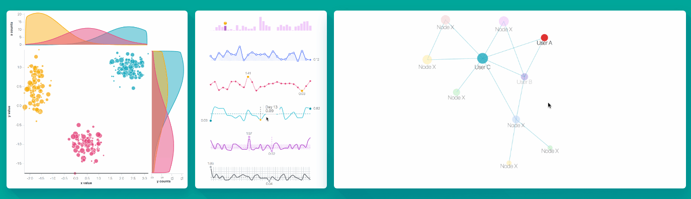
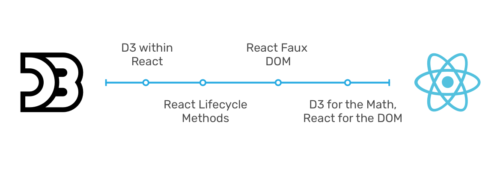

### Tại sao phải nói về D3.js và ReactJS?

Bởi đây là 2 trong số những thư viện phổ biến nhất giúp xây dựng giao diện web: 
- [D3.js](https://d3js.org/): thiên về trực quan hóa dữ liệu, tăng cường tương tác với người dùng.
- ReactJs: dựa trên component, state, props, và các lifecycle để giúp lập trình viên cấu trúc hóa phần front-end như nhưng miếng lego, tăng khả năng tái sử dụng các module.

Mặc dù cùng chung 1 mục đích là xây dựng phần giao diện, cách làm việc của 2 thư viện này xung đột với nhau. Một bên can thiệp trực tiếp vào DOM (D3.js), còn 1 bên tương tác qua DOM ảo. Vì sự phổ biến của cả 2, nhiều lập trình viên tìm cách để cho 2 thư viện này có thể chung sống hòa bình trong cùng 1 dự án nhằm xây dựng những tính năng ngầu nhất có thể.

Hình minh họa dưới đây lấy từ thư viện [React-D3 VX](https://vx-demo.now.sh/) để minh hoạt một phần kết quả của việc kết hợp D3 với React. 



Phần bên dưới đây không nhằm trình bày về D3.js hay React mà chỉ là tóm tắt lại phần so sánh 5 phương pháp tiếp cận khi phối hợp D3.js với React. Nó được trình bày trong bài [Bringing Together React, D3, And Their Ecosystem](https://www.smashingmagazine.com/2018/02/react-d3-ecosystem/) của Marcos Iglesias, một lập trình viên người Tây Ban Nha đang sống và làm việc ở San Francisco. Bài đăng trên Smashingmagazine ngày 2018.02.21. 

Nội dung được rút thành 3 phần:
 - Năm (05) hướng tiếp cận khi đưa D3js và Reactj về chung 1 nhà
 - Demo code cho từng hướng
 - Nên chọn cách tiếp cận nào?

### Hướng tiếp cận khi đưa D3js và ReactJs về một nhà (chung dự án)

Cả 2 thư viện trên:
- đều chia sẻ 1 mục tiêu, đó là giúp người dùng (lập trình viên) làm việc với DOM theo cách tối ưu nhất. 
- Sử dụng "pure function (hàm thuần)", tránh side effect, không gây biến đổi dữ liệu đầu vào.

Tuy vậy, người dùng sẽ phải trả lời câu hỏi là sẽ dùng cái nào (D3 hay React) để render và hoạt hóa các phần tử trên giao diện người dùng. Một nguyên tắc đầu tiên mà ta cần phải thống nhất, đó là "**Không bao giờ để cho cả 2 thư viện cùng một lúc tác động đến DOM**".

Tác giả Marcos Iglesias trình bày 5 cách tiếp cận, được tóm tắt ở bảng bên dưới đây. Code mẫu sễ để bên dưới để giảm "nhiễu".

* Lưu ý: SSR = Server Side Rendering

|#   | Tên gọi   | Mô tả | Ưu điểm | Nhược điểm |
|--- |---        |---    |---       |---        |
|1   |D3.js within React | Copy nguyên code D3.js đặt vào bên trong `componentDidMount()`, component `shouldComponentUpdate()` return `false`.| Đơn giản, dễ dùng | Số dòng code trong 1 file dài, không đúng tư duy component của React. Không tạo ra được 1 phiên bản của chart lúc mới render HTML (do React render server không gọi `componentDidUpdate`)
|2   |React Faux DOM | Sử dụng fake DOM để lừa D3.js nghĩ rằng đang làm việc với DOM thật. | Đơn giản, dễ dàng tận dụng code D3js hiện tại, cho phép SSR.| Hiệu suất có thể giảm bởi lại có thêm fake DOM đặt trước virtual DOM. Giới hạn trong những ứng dụng nhỏ và vừa.
|3   |Lifecycle Methods Wrapping | Sử dụng các lifecycle method của React để tạo, update, và remove D3.js chart | Tạo ra component nhẹ, dễ sử dụng, phân chia công việc rõ ràng, dễ tích hợp với code D3.js có sẵn. | Không hỗ trợ SSR | 
|4   |React for the DOM, D3 for Math | Giới hạn việc dùng D3.js tối đa, chỉ dùng D3.js cho tính toán SVG path, scale, layout, v.v. | Thân thiện nhất với React, đưa cho React quyền tối đa làm việc với DOM, tương thích với SSR | Cần nhiều kiến thức về cách làm việc của D3.js. Đôi lúc phải viết lại vài tính năng của D3.js như axes, shapes, brush, .v.v tức là tạo thêm việc.|
|5   |Sử dụng các thư viện React-D3.js | - | Nhanh, gọn, làm được việc luôn nếu thư viện hỗ trợ | Các thư viện dùng cho phát triển sản phẩm thương mại vẫn còn ít |

Bốn cách tiếp cận đầu tiên có thể được mô tả bằng biểu đồ bên dưới (lấy từ bài viết gốc). Đầu bên trái là D3js, đầu bên phải là React. Tùy vào bản chất của từng cách mà nó sẽ được đặt nằm lệch về 1 trong 2 thư viện.



### Demo code cho từng cách tiếp cận

Các code demo dưới đây đều lấy từ bài viết gốc của Marcos. Hơi dài dòng, chủ yếu là để tham khảo. 

Hơn nữa, tham khảo code mẫu, tôi hiểu [React app "Kính vạn hoa"](https://ngminhtrung.github.io/react-draw-spirograph/) của mình làm có thể xếp vào cách tiếp cận thứ 4 "*React for the DOM, D3 for Math*".

#### Cách 1: D3.js within React:

```javascript
class Line extends React.Component {
    static propTypes = {...}
    componentDidMount() {
        // D3 Code to create the chart
        // using this._rootNode as container
    }
    shouldComponentUpdate() {
        // Prevents component re-rendering
        return false;
    }
    _setRef(componentNode) {
        this._rootNode = componentNode;
    }
    render() {
        <div className="line-container" ref={this._setRef.bind(this)} />
    }
}
```

#### Cách 2: React Faux DOM:
```javascript
import {withFauxDOM} from 'react-faux-dom'

class Line extends React.Component {
    static propTypes = {...}
    componentDidMount() {
        const faux = this.props.connectFauxDOM('div', 'chart');
        // D3 Code to create the chart
        // using faux as container
        d3.select(faux)
            .append('svg')
        {...}
    }
    render() {
        <div className="line-container">
           {this.props.chart}
        </div>
    }
}
export default withFauxDOM(Line);
```

#### Cách 3: Lifecycle Methods Wrapping:

```javascript
import D3Line from './D3Line'
class Line extends React.Component {
    static propTypes = {...}
    componentDidMount() {
        // D3 Code to create the chart
        this._chart = D3Line.create(
            this._rootNode,
            this.props.data,
            this.props.config
        );
    }
    componentDidUpdate() {
        // D3 Code to update the chart
        D3Line.update(
           this._rootNode,
           this.props.data,
           this.props.config,
           this._chart
        );
    }
    componentWillUnmount() {
        D3Line.destroy(this._rootNode);
    }
    _setRef(componentNode) {
        this._rootNode = componentNode;
    }
    render() {
        <div className="line-container" ref={this._setRef.bind(this)} />
    }
}

```

Cách 3 này đi với D3line kiểu như sau:
```javascript
const D3Line = {};
D3Line.create = (el, data, configuration) => {
    // D3 Code to create the chart
};
D3Line.update = (el, data, configuration, chart) => {
    // D3 Code to update the chart
};
D3Line.destroy = () => {
    // Cleaning code here
};
export default D3Line;
```

#### Cách 4: React cho DOM, D3 cho tính toán:

```javascript
class Line extends React.Component {

    static propTypes = {...}

    drawLine() {
        let xScale = d3.scaleTime()
            .domain(d3.extent(this.props.data, ({date}) => date));
            .rangeRound([0, this.props.width]);

        let yScale = d3.scaleLinear()
            .domain(d3.extent(this.props.data, ({value}) => value))
            .rangeRound([this.props.height, 0]);

        let line = d3.line()
            .x((d) => xScale(d.date))
            .y((d) => yScale(d.value));

        return (
            <path
                className="line"
                d={line(this.props.data)}
            />
        );
    }

    render() {
        <svg
           className="line-container"
           width={this.props.width}
           height={this.props.height}
        >
           {this.drawLine()}
        </svg>
    }
}
```

#### Các thư viện React-D3.js

Một số thư viện được giới thiệu:
- [Victory](http://formidable.com/open-source/victory/)
- [Rechart](http://recharts.org/#/en-US)
- [Nivo](http://nivo.rocks/#/)
- [VX](https://vx-demo.now.sh/) --> đây chính là thư viện của Airbnb được giới thiệu trong bài số 1 bên trên.
- [Britecharts React](https://eventbrite.github.io/britecharts-react/)

### Chọn cách tiếp cận/ hay thư viện nào?

Dựa vào 4 tiêu chí "Chất lượng", "Thời gian", "Phạm vi công việc", và "Chi phí":

- Nếu ưu tiên **chất lượng**: xem xét sử dụng code base đã được test kỹ lưỡng, cập nhật với bản D3.js v4 (hiện tại là v5), có tài liệu hướng dẫn rõ ràng.

- Nếu ưu tiên **thời gian**: 
    - Trường hợp coi đây là một khoản đầu tư lâu dài, thì nên tạo 1 thư viện dựa vào D3js, rồi bọc nó lại trong React giống như cách "lifecycle method wrapping". Cách này giúp phân tách code rõ ràng, một bên là D3.js, 1 bên là ReactJS, dễ maintain sau này.
    - Nếu thời gian hạn hẹp, không cần phải maintain dự án một thời gian dài, thì hãy chọn lấy 1 thư viện React-D3.js hoặc D3.js gần nhất với yêu cầu, fork thư viện để sử dụng, cố gắng đóng góp ngược lại cho thư viện đấy trong quá trình làm dự án. 

- Nếu ưu tiên **phạm vi công việc**: Hãy xem mình cần chart loại gì? 
    - Một vài chart cơ bản? sử dụng thư viện nào đáp ứng đúng cái mình cần. 
    - Với chart phức tạp, được tùy biến theo các đơn đặt hàng, có nhiều animation hoặc interaction, thì sử dụng D3.js thuần là lựa chọn tối ưu. 
    - Nếu định làm nhiều loại chart với các yêu cầu cụ thể cho từng cái, thì nên xây dựng tự đầu, hoặc dựa trên một thư viện có sẵn nào đó.

- Nếu **chi phí** là ưu tiên: Việc này dựa vào ngân quỹ cũng như trình độ của đội hiện tại.
    - Nếu có sẵn lập trình viên thông thạo D3.js -> Sử dụng "Lifecycle Methods Wrapping".
    - Nếu chỉ toàn dân ReactJs, thì tốt hơn là nên mở rộng thư viện React-D3.js nào đó, hoặc tận dụng lifecycle method với những ví dụ D3.js. Đừng tự viết thư viện React-D3.js riêng, nó mất nhiều thời gian công sức, cả trong lúc phát triển, lẫn khi maintain sau này.

### Tham khảo

Bốn bài dưới đây sắp theo thứ tự thời gian, bài mới lên đầu. Bài số 1 tìm được trong Slack D3.js. Từ bài 1 dẫn đến bài 2, 3 và 4. Trong những bài này, bài số 2 vừa cập nhật (2018), vừa phổ quát.

1. [Data Visualization @ Airbnb -- React.js Meetup April 12, 2018](https://pasteapp.com/p/MszqF8XXBP9). Tác giả: Chris Williams. Data Vis Desi-engineer tại Airbnb. Đây là presentation tại Meetup "[ReactJs at Zendesk](https://www.meetup.com/ReactJS-San-Francisco/events/243658035/)".
2. [Bringing Together React, D3, And Their Ecosystem](https://www.smashingmagazine.com/2018/02/react-d3-ecosystem/). Tác giả: Marcos Iglesias is a Spanish Software Engineer living and working in San Francisco. Marcos is passionate about creating test-driven data visualizations and dashboards using D3 and Frontend technologies like ES2015, React, Redux and Webpack. On top of all that, he enjoys writing blog posts, giving talks and maintaining Britecharts, the open source charting library. Ngày đăng: 2018.02.21.
3. [React + D3.js: Balancing Performance & Developer Experience](https://medium.com/@tibotiber/react-d3-js-balancing-performance-developer-experience-4da35f912484). Tác giả: Thibaut Tiberghien, 
Senior Data Experience Developer tại Thomson Reuters Labs. Ngày đăng: 2017.05.17.
4. [Integrating D3.js visualizations in a React app](http://nicolashery.com/integrating-d3js-visualizations-in-a-react-app/). Tác giả: Nicolas Hery, Software Developer. Ngày đăng: 2014.09.07.