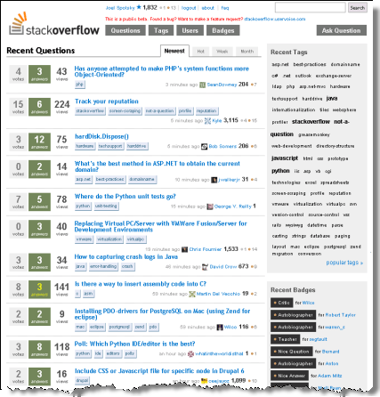

> Tôi đã gặp rất nhiều người muốn làm kinh doanh chỉ đơn giản vì họ muốn kinh doanh. [Paul Graham gọi đây là một “Playing House.”](http://startupclass.samaltman.com/courses/lec03/) Những người đó không quan tâm thứ họ kinh doanh là gì; việc đắp lên trên mình chữ "doanh nhân" đã là quá đủ. Điều này vớ vẩn vô cùng, bởi việc là một doanh nhân vô cùng vất vả. Làm sao có thể vượt qua những khó khăn, đau đớn, căng thẳng tột cùng khi mở một doanh nghiệp nếu bạn không có một động lực thực sự đủ lớn để giải quyết 1 vấn đề nào đó cho thế giới xung quanh? 

> Một doanh nhân thành công bởi vì họ thấy việc họ làm vô cùng quan trọng, và nếu chưa thực hiện được tâm nguyện, họ sẽ làm việc như điên cho đến khi nó đạt kết quả. Khi chúng tôi bắt đầu Stack Overflow, chúng tôi chẳng hề kỳ vọng nó sẽ biến thành một công việc kinh doanh đồ sộ; chúng tôi chỉ muốn tạo ra một nơi để các lập trình viên có thể nhận được giúp đỡ khi bế tắc trong công việc hàng ngày; hoặc là để khoe mình tài giỏi ra sao khi có thể giúp các đồng nghiệp khác.

Đó là lời kết thúc trong [The Stack Overflow Age](https://www.joelonsoftware.com/2018/04/06/the-stack-overflow-age/) - bài đầu tiên trong chuỗi bài kỷ niệm 10 năm thành lập [Stack Overflow](https://stackoverflow.com/) của Joel Spolksy (người sáng lập ra chính mạng xã hội lớn nhất của lập trình viên trên toàn thế giới). Tôi đọc bài này, thấy nó không những chứa thông tin về lịch sử hình thành của StackOverflow, mà còn là những quan sát của Joel về tâm lý số đông, sự thờ ơ và nghĩ ai cũng đang làm việc đó cho mình, còn bản thân thì chỉ việc ngồi chờ. Là một lập trình viên, dù có ở Việt Nam đi chăng nữa, thì bạn cũng đang dùng Stack Overflow hàng ngày. Vậy sẽ hợp lý khi đọc về nó, do chính người sáng lập của nó viết, để hiểu những gì chúng ta có hôm nay đã được nhào nặn như thế nào trong quá khứ. Thế giới World Wide Web giờ là một thứ tất yếu đến mức nhiều người cũng không biết trước World Wide Web là gì nữa. Phần bên dưới đây là dịch lại bài viết trên. Hy vọng chút thời gian của tôi đem lại thêm chút hiểu biết cho ai đó đang đọc bài này...

---

**Thời đại của Stack Overflow**

*Joel Spolksy - đăng ngày 06, tháng Tư năm 2018.*

Vậy là chỉ còn vài tuần nữa (tính từ 2018-04-06), chúng tôi sẽ công bố triển khai Stack Overflow Teams, bản nâng cấp lớn nhất từ trước đến nay. Chuyện này sẽ vô cùng thú vị. Tôi sẽ viết về nó trong 1 blog tới đây.

Hôm nay chỉ là chương đầu tiên. Tôi muốn nói một chút về những gì xảy ra trong cộng đồng lập trình viên thế giới trước Stack Overflow, vấn đề mà Stack Overflow đã cố gắng giải quyết từ lúc mới bắt đầu.

Trong những ngày sơ khởi của Internet, trước cả Web, có một hệ thống tên là [Usenet](https://today.duke.edu/2010/05/usenet.html) đã giúp tạo ra những diễn đàn trao đổi online nguyên sơ nhất. Mỗi khi lập trình viên có vấn đề gì với code của họ, họ có thể đặt câu hỏi trên một diễn đàn Usenet. Nếu nói một cách chính xác về thuật ngữ kỹ thuật, ta phải gọi đó là newsgroup, không phải diễn đàn (forum), mặc dù nội dung bên trong chả có news nào cả. Mà có muốn bạn cũng chả thể có được news (bản tin mới) từ Usenet.

Cho đến khi World Wide Web hình thành, Usenet bị đào thải ngay lập tức. Chúng tôi, những lập trình viên, bắt đầu hỏi nhau trên rất nhiều diễn đàn dựa vào web, số lượng diễn đàn có thể lên đến hàng nghìn.

Một trong những diễn đàn lớn nhất thời bấy giờ tên là Expert Exchange. Phiên bản đầu tiên của Expert Exchange không thành công về mặt tài chính. Năm 2001, những người đứng sau Expert Exchange cạn tiền để duy trì nó. Sau đấy, ổng chủ mới của Expert Exchange đã đưa ra một chiến lược mới, một mô hình kinh doanh thông minh hơn: đổi tiền lấy câu trả lời. 

Chiến lược này đã đem lại doanh thu, đem lại bước khởi sắc về mặt tài chính. Tuy nhiên, nó lại gây ra một vài vấn đề.

Vấn đề thứ nhất, đó là lập trình viên thường bắt đầu với Google chứ không phải Expert Exchange để tìm câu trả lời. Và bộ máy của Google vốn chỉ sục vào những trang web miễn phí, trang web mở, chứ không phải những website mà người dùng phải trả tiền để truy cập. Vì vậy, EE đã làm một một mẹo để lừa Google: mỗi khi Google Robot quét qua, EE cho hiện đầy đủ câu hỏi và câu trả lời. Nhưng khi truy cập vào link đó, người chưa trả tiền sẽ chỉ nhìn thấy một phần câu trả lời (phần còn lại bị che đi), kèm theo hướng dẫn thanh toán tiền (đâu đó khoảng 250 USD 1 năm) để có thể xem bản đầy đủ. Hầu hết lập trình viên đều không buồn thanh toán, họ bỏ đi.

Vấn đề thứ hai, đó là EE có cung cấp gói thành viên miễn phí, với điều kiện bạn phải trả lời một số lượng câu hỏi nhất định. Sau đó một thời gian, người ta thấy rằng hầu hết những người chăm chăm tìm cách nhận được gói thành viên miễn phí, thì lại không phải những người xuất sắc nhất, và đương nhiên, họ cũng chỉ cho ra những câu trả lời vừa vừa, thậm chí chất lượng thấp, để đổi lấy gói thành viên. Kết quả? chất lượng chung của các câu trả lời trên toàn diễn đàn này đi xuống.

Trong suốt một thời gian dài (tôi nghĩ là khoảng 5 năm), lập trình viên trên khắp nơi vẫn đều đặn đi ngang qua EE bởi Google dẫn họ đến đấy, thử click vào đường link, nhận ra đây là một website trả tiền, ngán ngẩm, quay lại Google tiếp tục đi tìm câu trả lời miễn phí ở nơi khác.

Lúc đó tôi đã nghĩ, việc duy trì một diễn đàn trên mạng có khó đến thế hay không? Lúc ấy tôi nghĩ đại là mình có thể code 1 diễn đàn bằng ngôn ngữ Visual Basic trong 2 ngày cuối tuần (Tôi không hề nói chơi. Tôi biết là mình luôn luôn tuyên bố là "Tôi có thể làm việc đó trong 2 ngày cuối tuần bằng Visual Basic", trong khi những lập trình viên khác cho rằng một vài tính năng có thể mất nguyên năm). Và thế là tôi an tâm cho rằng việc có một diễn đàn khác, miễn phí, cho lập trình viên sẽ chỉ là vấn đề thời gian, bởi có hơn 9 triệu những con người thông minh ngoài kia đều đang nghĩ về cùng 1 hướng (như tôi).

Bạn biết gì không? Chẳng có ai làm gì cả. Và tôi tiếp tục chờ đợi.

Một thứ khác mà tôi viết trong 1 tuần (ờ, chính xác là 2 tuần lễ) là một [bảng đăng tin tuyển dụng trên blog này](https://www.joelonsoftware.com/2006/09/05/introducing-jobsjoelonsoftwarecom/). Và ngay trong tháng đầu tiên kể từ lúc bản tin tuyển dụng đó hoạt động, chúng tôi đã thu về được khoảng 90 nghìn USD. Hu-raaaa! Và thế tôi nghĩ, nếu chúng tôi quện những ý tưởng lại, thay Expert Exchange bằng 1 website miễn phí, và duy trì nó nhờ tiền thu được từ bản tin tuyển dụng, thì chúng tôi có thể khắc phục những tổn thương trên mạng Internet (do EE gây ra), và giúp lập trình viên sớm hoàn thành công việc.

Tôi vẫn nghĩ là "Joel, hiển nhiên là sẽ có ai đó sẽ làm việc này."

Và "ai đó" đấy đã chẳng bao giờ xuất hiện.

Sau đấy tôi đến gặp 1 lập trình viên tại Fog Creek, giải thích về ý tưởng của mình, đại loại anh ấy trả lời như sau "Yeah yeah, thật là một ý tưởng tuyệt vời, nhưng tôi thực sự thích việc đang làm ở FogBugz."

Rồi thời gian lại tiếp tục đưa thoi. 

Cuối cùng, vào đầu năm 2008, một lập trình viên/ blogger tên là [Jeff Atwood](https://blog.codinghorror.com/) gọi cho tôi bảo rằng: "Này Joel, tôi đang tính nghỉ việc để trở thành tay viết blog chuyên nghiệp; anh cũng là 1 blogger, anh nghĩ sao?"

Tôi trả lời: "Jeff, tôi có ý này hay hơn cho anh", rồi tôi nói với anh ấy về ý tưởng kết hợp bản tin tuyển dụng với website Hỏi - Đáp cho lập trình viên. Mất hơn một cuối tuần để thuyết phục, nhưng cuối cùng Jeff cũng đồng ý. Chúng tôi thảo luận mọi cách để giúp trang Hỏi - Đáp trông thật sáng sủa. Jeff viết những dòng code đầu tiên vào tháng Tư năm 2008, rồi tuyển thêm 2 lập trình viên khác vào team (đó là Goeff và Jarrod, giờ vẫn đang làm ở Stack Overflow). Ba bọn họ đã chiến đấu oanh liệt để giúp Stack Overflow ra đời vào tháng Chín năm 2008.

Thế là một thời đại của Stack Overflow đã bắt đầu.

StackOverflow tốt hơn (so với EE) bởi nó miễn phí, và nó cũng có hàng tấn những "sáng kiến" trong mình (tôi đặt từ sáng kiến trong ngoặc kép bởi chúng tôi đã vay mượn nhiều thứ từ những con chim tiên phong khác trong thế giới Internet). Điều này đã giúp tạo ra một website tốt hơn rất, rất nhiều cho lập trình khi đi câu trả lời cho câu hỏi của họ.

Chúng tôi muốn mọi thứ phải vui vẻ như đang chơi game, ai trả lời thì phải có phần thưởng khích lệ; cho nên Stack Overflow có hệ thống tính điểm "danh tiếng". Bạn càng trả lời nhiều, thì danh tiếng của bạn càng tăng. Việc tính điểm danh tiếng đã có từ Slashdot và Reddit.

Một khi bạn đã có chút danh tiếng, bạn sẽ có thêm quyền để quản trị website này. Nghĩa là website đang tự quản lý lấy chính nó, việc này quả là hay ho.

Thay vì tóm tất cả những ai làm Java vào 1 diễn đàn nhỏ, còn C++ sang một nơi khác, chúng tôi nhét tất cả vào chung một nơi, và cho họ đánh dấu thẻ (tag) cho câu hỏi. Ý tưởng này thì vay từ [flickr](https://www.flickr.com/), còn flick vay từ ai, tôi nghĩ là họ vay từ del.icio.us (giờ đã biến mất). Thôi mặc kệ, chỉ cần biết các tag chính là thứ giúp cho Stack Overflow làm việc ngon lành.

Điều quan trọng nhất nằm ở chỗ, chúng tôi nhận ra mỗi người chỉ hỏi 1 câu thôi, nhưng hàng nghìn người khác lại nhìn thấy câu trả lời vốn được hiển thị trên Google khi tìm kiếm. Vậy là chúng tôi quyết định tối ưu mọi thứ để nó trở nên hữu ích cho số đông, chứ không phải từng cá nhân. Thường thì sẽ có 1000 lượt truy cập cho mỗi câu hỏi, thế nên mọi câu hỏi đều được sắp từ cao đến thấp qua số vote. Đó cũng là lý do tại sao chúng tôi tối ưu cách hiển thị câu hỏi và câu trả lời để những người đến sau cũng thấy hữu ích.

Điểm thú vị nữa là, khi Jeff và tôi bắt đầu với Stack Overflow, chúng tôi chẳng quan tâm đây có phải là phi vụ kinh doanh không nữa, cũng không cần nó phải tạo ra nhiều lợi nhuận. Chúng tôi tạo ra nó chỉ vì thế giới Internet xung quanh lúc ấy vẫn đang chưa có gì "ngon bổ rẻ" cho hội lập trình viên, và tụi tôi cần làm gì để xử lý chuyện này. Bản tin tuyển dụng sẽ giúp đem lại tiền để thanh toán hóa đơn, và đó là tất cả những gì chúng tôi quan tâm, tạo ra động lực để cả hội làm việc cật lực.

Dĩ nhiên, mọi thứ phát triển lớn hơn nhiều so với suy nghĩ lúc đầu. Giờ chúng tôi là một team gồm 250 người, có lợi nhuận, và đã tạo ra cơ hội cho hàng triệu lập trình viên học coding, cũng như học cách xử lý một thế giới mới và phức tạp với đầy rẫy API cũng như framework. Nói đi nói lại, chúng tôi đã một thời chỉ muốn cải thiện thế giới Internet mà thôi.

Tôi đã gặp rất nhiều người muốn làm kinh doanh chỉ đơn giản vì họ muốn kinh doanh. Paul Graham gọi đây là một “Playing House.” Những người đó không quan tâm thứ họ kinh doanh là gì; việc đắp lên trên mình chữ "doanh nhân" đã là quá đủ. Điều này vớ vẩn vô cùng, bởi việc là một doanh nhân vô cùng vất vả. Làm sao có thể vượt qua những khó khăn, đau đớn, căng thẳng tột cùng khi mở một doanh nghiệp nếu bạn không có một động lực thực sự đủ lớn để giải quyết 1 vấn đề nào đó cho thế giới xung quanh. 

Một doanh nhân thành công bởi vì họ thấy việc họ làm vô cùng quan trọng, và nếu chưa thực hiện được tâm nguyện, họ sẽ làm việc như điên cho đến khi nó đạt kết quả. Khi chúng tôi bắt đầu Overflow, chúng tôi chẳng hề kỳ vọng nó sẽ biến thành một công việc kinh doanh đồ sộ; chúng tôi chỉ muốn tạo ra một nơi để các lập trình viên có thể nhận được giúp đỡ khi bế tắc trong công việc hàng ngày; hoặc là để khoe mình tài giỏi ra sao khi có thể giúp các đồng nghiệp khác.

*Thân tặng nhóm [freeCodeCamp Hà Nội](https://www.facebook.com/groups/free.code.camp.hanoi/)*

ngminhtrung 2018.04.27

