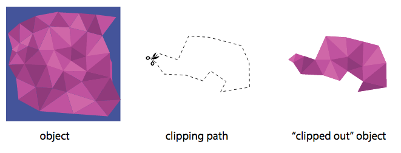

Nếu dùng D3js, có lúc nào bạn tự hỏi làm thế nào để tạo ra 1 đường thẳng chạy giống như hình dưới?

Hehe hình trên chỉ mang tính câu view. Mặc dù [tác giả Chris Whong của The NewYork Times đã làm hiệu ứng đường thẳng chạy trong chương trình trên](https://chriswhong.com/data-visualization/taxitechblog1/) bằng một kỹ thuật khác, trong bài này, tôi trình bày cách sử dụng `<clipPath>` của `svg` để tạo hiệu ứng tương tự trong những trường hợp đơn giản hơn. 

### Thế nào là "clipPath"?

Từ **clip** trong tiếng Anh có rất nhiều nghĩa. Trong các nghĩa mà từ điển [Oxford](https://en.oxforddictionaries.com/definition/clip) cung cấp, có 1 nghĩa ứng với nghĩa trong `svg`, đó là **cắt tỉa**.

**Path** nghĩa là **đường** (trong đường thẳng, đường nét). Vậy cứ tưởng tượng khi ta **clip path** một bức hình, là ta đang cầm kéo cắt tấm hình đó theo 1 đường bao vạch sẵn, sao đó vứt phần bên ngoài đi, chử giữ lại phần bên trong. Xem hình minh họa dưới đây sẽ rõ ([nguồn của bức hình](https://tympanus.net/codrops/css_reference/clip-path/)):

### Sử dụng "clipPath" như thế nào?

<svg width="450" height="200">
<defs>
<clipPath id="rectClip">
<rect id="rect1" x="5" y="40"
    width="50" height="50"
    style="stroke: gray; fill: none;"/>
<g id="house" style="stroke: red; fill: lightblue" >
    <desc>House with door</desc>
    <rect x="0" y="41" width="60" height="60" />
    <polyline points="0 41, 30 0, 60 41" />
    <polyline points="30 101, 30 71, 44 71, 44 101" />
</g>
</clipPath>
</defs>
<!-- clip to rectangle -->
<g transform="translate(30,0) scale(1.5)">
<use xlink:href="#house" x="0"/>
<use xlink:href="#rect1" x="200" />
<use xlink:href="#house" x="100" style="clip-path: url(#rectClip);"/>
</g>

</svg>