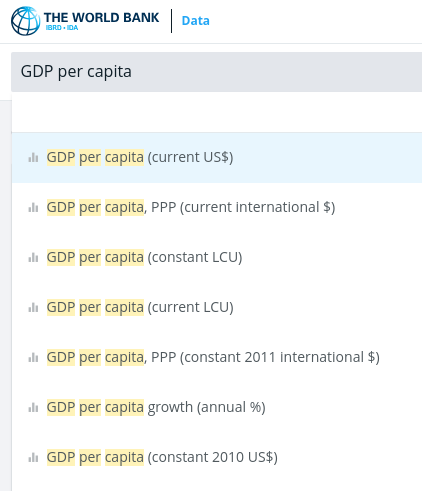

Làm việc với D3js được nửa năm, một trong những điều bận lòng là chưa vẽ được một chart nào về Việt Nam (trừ lác đác mấy cái đơn giản kiểu [này](https://ngminhtrung.github.io/d3/vietnam/vn-unemployment-2016), hay [đây](https://ngminhtrung.github.io/d3/vietnam/groupedbar/index.html)). Lý do chưa làm được chart nào tử tế? 
- Thiếu ý tưởng. Vẽ, ừ, nhưng vẽ cái gì bây giờ? định kể câu chuyện gì? về đề tài nào?
- Thiếu dữ liệu. Okie cứ lấy đại một ý tưởng hay đề tài từ hàng ngàn [ví dụ mẫu vẽ bằng D3js](https://github.com/d3/d3/wiki/Gallery), nhưng dữ liệu lấy từ đâu? xào nấu kiểu gì?
- Có quá nhiều thứ phải cân nhắc, như chọn loại đồ thị nào cho vấn đề nào, lên layout trình bày cho từng device, highlight dữ liệu nào, thêm tương tác người dùng kiểu gì, v.v.
- Nhiều lý do khác.

Sau khi đọc bài ["Economy of Vietnam" trên Wikipedia](https://en.wikipedia.org/wiki/Economy_of_Vietnam) và thấy một [[dự án của MIT biểu diễn dữ liệu kinh tế các quốc gia trên thế giới](https://atlas.media.mit.edu/vi/profile/country/vnm/), tôi tiến hành làm [trang mô tả số liệu Xuất - Nhập khẩu của Việt Nam năm 2016](https://ngminhtrung.github.io/d3/vietnam/export/). Kết quả trông như hình dưới đây (vẫn đang tiếp tục hoàn thiện, phần text chưa chính thức):


Tuy chưa hoàn thành, nhưng có thể tạm note lại một vài ý về 1 khâu rất nhỏ rất nhỏ liên quan về tìm và xử lý dữ liệu của Việt Nam. Nhũng ghi chú này không đại diện cho mọi cách giải quyết liên quan đến dữ liệu, nhưng đủ để kết luận:

| # | Kết luận | Mô tả |
|---|---        |---    |
| 1 | *Tìm nguồn dữ liệu không dễ* | Với người thường khó mà có được dữ liệu đầy đủ liệu muốn tìm, càng khó hơn khi là dữ liệu về Việt Nam. Một nguồn dữ liệu chính thống về kinh tế xã hội có thể tra từ [Tổng Cục Thống kê Việt Nam](https://www.gso.gov.vn/Default.aspx?tabid=217) (dù dữ liệu ở đây rất thiếu). Có thể phải trả tiền để có dữ liệu. Mất thời gian để tìm và download. |
| 2 | *Hiểu dữ liệu nói gì* | Nhiều dữ liệu phải người làm chuyên môn mới hiểu. Lập trình viên rất dễ hiểu sai những khái niệm chuyên ngành trong kinh tế hay khoa học. |
| 3 | *Convert, xử lý dữ liệu gốc sang dữ liệu mình cần tương đối mất thời gian* | Dữ liệu gốc nhiều khi không dùng được ngay, mà phải chuyển sang định dạng mình muốn dùng (ví dụ từ Excel sang CSV, từ CSV sang JSON), với cấu trúc mình cân. Xử lý sẽ mất thời gian tùy theo kinh nghiệm của lập trình viên. |
| 4 | *Khó dấu được dữ liệu gốc* | Data Visualization trên nền web rất khó dấu dữ liệu bởi mọi xử lý đều diễn ra phía client. Người dùng chỉ cần sử dụng Dev Tool để soi Source hoặc XHttpRequest là có thể lấy dữ liệu mà lập trình viên dày công chuẩn bị.| 

**Bài toán ban đầu là gì?** 
- Giúp người dùng hiểu thêm trong năm 2016 Việt Nam xuất khẩu cái gì, nhập khẩu cái gì, hàng xuất đến những nước nào, hàng nhập từ nước nào. 
- Quan trọng hơn, sau khi đọc hàng tá dữ liệu rồi đóng trang web lại, độc giả vẫn còn đọc lại 1- 2 loại hàng xuất khẩu chủ lực, 1 - 2 loại hàng nhập khẩu chính, nước nào là đối tác thương mại lớn.

**Dàn bài**:
- [x] Đồ thị dạng "đường" (line chart) để đưa ra khung cảnh xuất - nhập khẩu, cũng như GDP trên đầu người của Việt Nam trong 10 năm, từ 2007 đến 2016.
- [ ] Đồ thị "treemap" của Export và Import có thu phóng vào từng vùng.
- [ ] Đồ thị "chord" để thể hiện giao lưu thương mại giữa Việt Nam với các nước.

**Bốn (04) vấn đề của tìm và xử lý dữ liệu nói trên thể hiện qua từng bước như thế nào?**

### Bước 1: Tìm nguồn dữ liệu

Các nguồn đã thử như sau:
- [Tổng cục Thống kê Việt Nam](https://www.gso.gov.vn/default.aspx?tabid=629): Dữ liệu tản mát, ngắt quãng. 
- [Wikipedia - Economy of Vietnam](https://en.wikipedia.org/wiki/Economy_of_Vietnam): Không có dữ liệu.
- [Trading Economics](https://tradingeconomics.com): Dữ liệu phải mua
- [World Bank](https://data.worldbank.org/indicator/NY.GDP.PCAP.CD?end=2016&name_desc=false&start=2000&view=chart): Có dữ liệu miễn phí về GDP trên đầu người từ 1960 đến 2016. Có cho download dạng CSV, XML hoặc EXCEL.
- [UN Comtrade Database](https://comtrade.un.org/): Có dữ liệu về xuất nhập khẩu của các nước trên thế giới từ quá khứ đến hiện tại (2017). Dữ liệu được phân loại rõ ràng, miễn phí. Có cho download dạng CSV. Tuy nhiên có giới hạn về số lượng dữ liệu preview/ query trong 1 lần, vì thế mà để có 1 bộ dữ liệu về Export thì phải filter và download nhiều lần.

> ➡️ Đây là lý do để kết luận việc *"**tìm nguồn dữ liệu**" là nan giải thứ nhất cho người làm trực quan hóa dữ liệu về Việt Nam*.

**Giải pháp**? Nằm ngoài tầm với của từng cá nhân. Người làm dự án phải tự đi tìm, tổng hợp dữ liệu từ các nguồn khác nhau. Tuy nhiên, cần luôn ghi nguồn cũng như cách thức tổng hợp dữ liệu. Nên lưu ý là data visualization không chỉ có mục tiêu là "làm đẹp" giống như design một trang web, hay một chi tiết nào đó. Data visualization còn là một công việc mang tính khoa học. Cẩu thả trong việc lấy dữ liệu có thể khiến sản phẩm cuối khi được lan truyền đi có thể gây ra một thông điệp sai về chủ đề nào đó.

### Bước 2: Hiểu dữ liệu

- Dữ liệu về "GDP trên đầu người" của World Bank sẽ có nhiều loại: "GDP per capita (current US$)", "GDP per capita, PPP (current international $)", v.v. biết chọn cái nào cho thống nhất về mặt bản chất số liệu với những dữ liệu khác?
- Dữ liệu về xuất nhập khẩu có "HS code" là gì? phân loại ra sao? Có hiểu được mới đọc được dữ liệu của UN Comtrade Database, vốn lưu theo các thông lệ và quy định của quốc tế, trong đó hàng hóa được phân theo từng loại, đánh số tăng dần theo từng cụm 02 chữ số. Nhờ dữ liệu được đánh mã số khoa học mà ta có thể tạo được treemap chart, giúp phân vùng những mặt hàng xuất khẩu thuộc cùng một nhóm.

> ➡️ Đây là lý do để kết luận việc *"**hiểu về dữ liệu**" là thách thức thứ hai cho người làm trực quan hóa dữ liệu về Việt Nam*.

**Giải pháp**? Hỏi chuyên gia, hoặc đọc thêm về chủ đề đang xử lý.




### Bước 3: Convert từ dữ liệu gốc sang định dạng mong muốn

Dữ liệu gốc có thể là dạng CSV phẳng:

```csv
Reporter,Reporter_ISO,Partner_Code,Partner,Partner_ISO,Commodity_Code,Commodity,Trade_Value
Canada,CAN,704,Viet Nam,VNM,101,"Live horses, asses, mules and hinnies",72
Singapore,SGP,704,Viet Nam,VNM,101,"Live horses, asses, mules and hinnies",206018
```

Dữ liệu trên cần chuyển sang JSON có cấu trúc hình cây (nếu vẽ bằng D3js):

```json 
{
    "name": "vietnam_export_2016",
    "children": [
        {
            "name": "10",
            "description": "Cereals",
            "children": [
                {
                    "value": 319330,
                    "description": "Buckwheat, millet and canary seed, other cereals"
                },
                {
                    "value": 11872,
                    "description": "Grain sorghum"
                },
```

**Công cụ để chuyển dữ liệu**:
- Javascript cho trường hợp cụ thể này. [Link](https://ngminhtrung.github.io/d3/vietnam/export/data-converting.js).
- Excel/ Libre Office
- Các package xử lý CSV/ JSON trên Linux. Ví dụ tại [đây](https://kipalog.com/posts/Xu-ly-CSV-data-voi-csvkit-tren-giao-dien-dong-lenh).
- Các package xử lý data của Python.

> ➡️ Đây là lý do để kết luận việc *người làm dataviz cần dành một quỹ thời gian nhất định để xử lý, chuyển đổi dữ liệu từ định dạng gốc sang định dạng và cấu trúc mới*.

**Giải pháp**? Thực hành nhiều để quen với các loại dữ liệu, các phương pháp và công cụ xử lý dữ liệu.


### Bước 4: Dấu dữ liệu gốc

Khó. Người dùng biết cách tìm sẽ thấy ngay ở phần fetch data của browser.

> ➡️ Đây là lý do để kết luận việc **dấu dữ liệu** là chưa khả thi ở thời điểm này khi làm trực quan hóa trên nền web.

**Giải pháp**? Với những dữ liệu quan trọng cần bảo vệ, hãy render trước từ server và chuyển file ảnh đến browser của người dùng.

**Cập nhật 08.05.2018** từ Tom MacWright trên D3js Slack:
> You can
>- restrict access to the application to only people you trust
>- do the aggregation on the server side so only the sum / average /indicator shown on the chart is served to the page
>
> The basic principle is "**if you don't want to share it, don't send it to a browser**". there is no 'encryption' or 'privacy' possible if you also want a data object to be parsed and visualized by d3. so if you want to conceal detailed data, aggregate it into less detailed data using a method that you can be certain can't be disaggregated


### Kết luận

Không có bột chẳng gột nên hồ. Không có dữ liệu sẽ chẳng lấy ra thứ để mà kể chuyện (tell a story), hoặc dữ liệu sai sẽ đem lại câu chuyện có nội dung sai. Tìm và hiểu dữ liệu, xử lý dữ liệu nhanh và chuẩn xác, và bảo vệ dữ liệu của mình sẽ là một câu truyện dài cần thực hành không ngừng.

### Tham khảo

Những "tác phẩm" mẫu mực về áp dụng Data Visualization vào các chủ đề kinh tế - chính trị - xã hội của Tây:

- [The New York Times - 2013: The Year in Interactive Storytelling](http://www.nytimes.com/newsgraphics/2013/12/30/year-in-interactive-storytelling/index.html): Tập hợp các bài tiêu biểu của năm 2013 sử dụng các kỹ thuật tăng tính tương tác trên nền web.

- Những tác phẩm của [Mike Bostock](https://bost.ocks.org/mike/)

- [Tổng hợp kết quả bầu cử tổng thống Mỹ năm 2016](http://graphics.wsj.com/elections/2016/results/) của Elliot Bentley

- [Cách mà nước Mỹ di dời những người vô gia cư](https://www.theguardian.com/us-news/ng-interactive/2017/dec/20/bussed-out-america-moves-homeless-people-country-study) của Nadieh Bremer

và còn rất nhiều rất nhiều người nữa với những sản phẩm khiến ta há hốc mồm về cả trình độ kỹ thuật lẫn con mắt thẩm mỹ của họ.