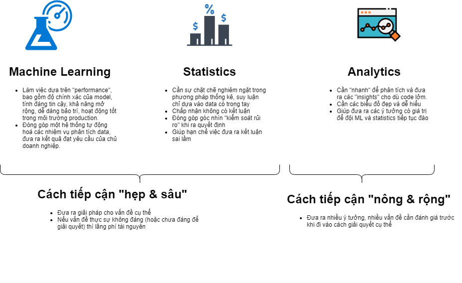

Tóm tắt lại bài viết của [Cassie Kozyrkov, Chief Decision Scientist - Google](https://www.linkedin.com/in/cassie-kozyrkov-9531919) đăng trên [Harbard Business Review vào tháng 12 năm 2018](https://hbr.org/2018/12/what-great-data-analysts-do-and-why-every-organization-needs-them).

Trong bài viết này, tác giả Cassie mở đầu với câu hỏi rằng: Khi AI đang là mốt, nhu cầu tuyển dụng một “full-stack” data scientist dâng lên cao, trong khi thực tế lại chẳng dễ tuyển người thành thạo cả ba kỹ năng (1) *machine learning* (học máy), (2) *statistics* (thống kê), và (3) *analytics* (phân tích), vậy các tổ chức/ doanh nghiệp nên đề cao người có kỹ năng nào?

Trong 3 kỹ năng trên, nếu nhìn qua các thông tin tuyển dụng, thì người ta thấy rõ ràng "AI/ machine learning" skill đang là thứ được mong chờ nhất. Sau đó đến "statistics" vốn đã có danh tiếng trong một thế kỷ với những nền tảng toán học. Vậy còn "analytics" thì sao?

Trong bài viết của mình, Cassie đã phân tích lần lượt điểm mấu chốt trong công việc của người làm ML, statistics, và analytics. 
- Ông cho rằng dữ liệu nắm trong tay khi được data analyst phân tích sẽ giúp decision makers nhìn ra nhiều vấn đề, nhiều giả thiết, nhiều ý tưởng dưới các góc độ khác nhau. 
- Vai trò của data analyst chính là việc đưa ra cách tiếp cận "nông và rộng", giúp decison maker quyết định nên chọn hướng nào, đưa bài toán cho ML và statistician tiếp tục đào sâu theo hướng "hẹp và sâu". 
- Việc chú trọng vào ML và statistics, vốn quen với các bài toán cụ thể, sẽ dẫn đến rủi ro là đi giải những bài toán chưa cần thiết, hoặc không đáng. 

Tác giả nhận xét rằng một vấn đề chủ chốt trong data science, đó chính là sự thiếu vắng "analytics expertise".

Thêm nữa, Cassie nhận định analyst xứng đáng giữ vai trò "decision maker" nhất so với ML và statistician. Và việc analyst có nhiều hiểu biết trong domain là cực kỳ quan trọng, không có domain là coi như thất bại. 

PS: English learning corner

- [quit on someone](https://idioms.thefreedictionary.com/quit+on)
  1. [for something] to quit while someone is using it. This stupid car quit on me. I hope this thing doesn't quit on me.
  2. [for one] to leave one's job, usually suddenly or unannounced. Wally, the park supervisor, quit on us at the last minute. My assistant quit on me.
- [put someone on a pedestal](https://www.macmillandictionary.com/dictionary/british/put-someone-on-a-pedestal): to admire or love someone so much that you believe they have no faults. Example: He had a tendency to put women on a pedestal.

