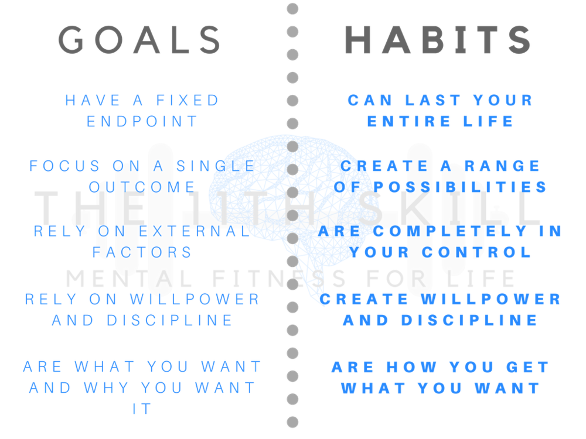

Ghi chú: Tên bài viết được lấy cảm hứng từ bài ["Mục tiêu hay là quá trình"](https://huydx.com/post/169616312074/m%E1%BB%A5c-ti%C3%AAu-hay-l%C3%A0-qu%C3%A1-tr%C3%ACnh) của tác giả huydx viết tháng 1 năm 2018. huydx đã không dùng từ "mục tiêu vs. thói quen" như trong bài ["Habits vs. Goals: A Look at the Benefits of a Systematic Approach to Life"](https://fs.blog/2017/06/habits-vs-goals/) hoặc bài ["Why Are Smart People So Miserable?"](https://www.inc.com/geoffrey-james/why-are-smart-people-so-miserable.html), mà thành "mục tiêu vs. quá trình".

2019 đã sang đến tháng 2 rồi mà bản thân vẫn chưa có một danh sách các mục tiêu cần làm trong năm. Rồi khi đọc bài của huydx, nhớ ra là [những gì mình đề ra cho 2018](https://travisnguyen.net/selfpondering/2017/12/30/lookback-2018-resolution/) cuối cùng chẳng làm mấy, thì thấy rõ ràng cách mình định nghĩa và đặt các mục tiêu chưa hợp lý, khiến mình kết thúc năm mà không có cảm giác fulfilled.

huydx đã tóm tắt cũng như rút ra kết luận rất hợp lý, đó là:
- không thể không có mục tiêu, thiếu nó mình chẳng có định hướng để biết biết nên đi về đâu", 
- nhưng cũng không nên coi mục tiêu là thứ quan trọng nhất để đánh giá thành quả, mà nên nhìn vào cả quá trình để tự mình cảm thấy hạnh phúc.

Để cả mục tiêu và quá trình đều đồng hành, nên tìm cách diễn giải quá trình cho phù hợp. Ví dụ:
- Để trở thành senior hơn trong lĩnh vực "A" (mục tiêu), một trong những việc cần làm là đọc nhiều sách báo cập nhật trong lĩnh vực này. Vậy:
  - NÊN là: quá trình (hay thói quen) đề ra là mỗi tuần đọc và tóm tắt ít nhất 01 bài ở trang times_of_A.com, mỗi tuần đọc và tóm tắt 01 chương của quyển sách B chẳng hạn. 
  - Mà KHÔNG NÊN CHỈ là: đọc bài của trang times_of_A.com, hay "đọc xong quyển sách B" (không hề có yếu tố "thói quen" hàng ngày hàng tuần)
- Để trở lập trình tốt hơn với ngôn ngữ "P" (mục tiêu), một trong những việc cần làm là phải code nhiều hơn. Vậy:
  - NÊN là: quá trình (hay thói quen) đề ra là mỗi ngày code tối thiểu 30 phút, có thể code cái mới, hoặc code lại theo tutorial/ sách báo sẵn có.
  - Mà KHÔNG NÊN CHỈ là: hoàn thành khoá "Fundamentals of P" ở trang edx, coursera, v.v. (vẫn không hề có yếu tố thói quen hàng ngày hàng tuần)
- v.v

*Kết luận*: Cho đến tận lúc này, dù chưa nhìn thấu đáo mục tiêu của 2019, nhưng đã thấy không còn hoang mang vì hoá ra có những thứ đã thành thói quen (ví dụ như viết lách) vẫn đang được duy trì mà chưa bị đánh mất. Những thói quen này vẫn đang đóng góp vào thành quả cuối cùng, cho dù đôi lúc thấy thói quen ấy chẳng ăn nhập gì với những mục tiêu đề ra ban đầu. Còn mục tiêu, vẫn cần nghĩ cẩn thận để chọn ra 2 - 3 thứ quan trọng nhất của năm bản lề này. 

PS: Bảng mô tả tóm tắt về Mục tiêu và Thói quen dựa theo các bài viết tham khảo trích dẫn bên trên.

