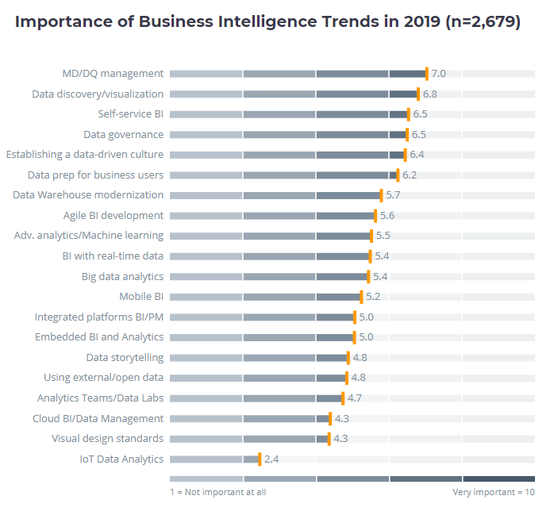
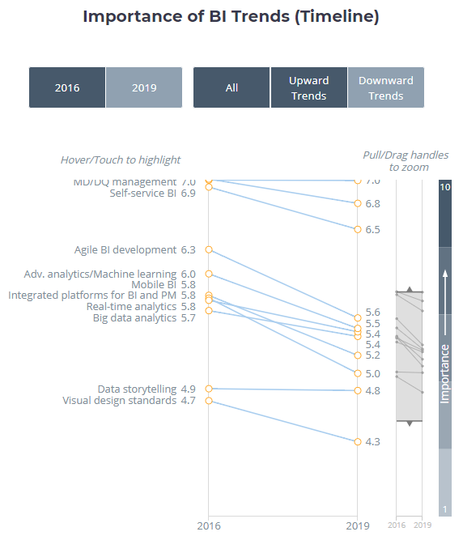

"Business Intelligence (BI)" là một trong những topic thường gặp khi nói về "Digital Transformation". "Business Intelligence" gắn với nhu cầu của một doanh nghiệp về việc nắm bắt thông tin về hoạt động sản xuất kinh doanh để có thể ra quyết định kịp thời ngày một cao. Các thông tin về nội bộ doanh nghiệp cần phải được quản lý tổ chức, cập nhật liên tục, chính xác, đồng nhất từ mọi level của tổ chức, từ đó làm input cho các bài toán phân tích cao cấp để đưa ra các dự đoán xu hướng, tìm nguyên nhân, tìm mối quan hệ nhiều chiều trong một lượng data khổng lồ. Không chỉ các doanh nghiệp thế giới, mà các doanh nghiệp ở Việt Nam chắc chắn cần những giải pháp và công cụ BI để giúp cải thiện nâng cao hiệu quả kinh doanh. 

Tóm tắt dưới đây là của trang BI-survey.com, phỏng vấn hơn 2.600 người làm trong lĩnh vực BI trên thế giới, để hiểu những xu hướng quan trọng trong năm 2019. Biết được những xu hướng này, và phân tích những lý do đằng sau của mỗi xu hướng sẽ giúp người làm BI cũng như doanh nghiệp trong nước có những hình dung cụ thể hơn công việc mình cần làm với chủ đề này. 

Bài viết gốc: https://bi-survey.com/top-business-intelligence-trends

==========================

Theo như kết quả khảo sát, ba xu hướng quan trọng nhất của năm 2018 vẫn còn nguyên khi sang 2019 đó là:
- vị trí 1: master data và data quality management
- vị trí 2: data discovery
- vịu trí 3: self-service BI

Nếu *master data & data quality management* giúp xây dựng một nền tảng vững chắc cho việc xử lý data sau này, thì việc quan tâm đến *data discovery* và *selff-service BI* là tín hiệu mạnh mẽ cho thấy càng ngày người dùng muốn mình được tự mình khám phá dữ liệu. 

Nhận định trên càng được củng cố khi mà xu hướng vừa được thêm vào, giữ vị trí thứ 5, đó là "thiết lập một văn hoá hướng đến dữ liệu (data-driven culture)", vốn phụ thuộc vào sự tham gia của rất nhiều phòng ban bộ phận kinh doanh trong doanh nghiệp (bên cạnh bộ phận CNTT).

*Data governance*, vốn giữ nguyên ở vị trí thứ 4, dường như vẫn là một xu hướng quan trọng. Ở đây, một lần nữa, GDPR ([General Data Protection Regulation](https://en.wikipedia.org/wiki/General_Data_Protection_Regulation)) lại thể hiện sức ảnh hưởng. Dẫu "data governance* trải một dải rộng hơn rất nhiều chứ không chỉ là *data protection*, tầm quan trọng của *data governance* ngày một cao bắt nguồn từ nhận thức (của các chính phủ, trong cộng đồng) về *data security* tăng lên.

Sự thiếu quan tâm của đối tượng được khảo sát đến *IoT analytics* dẫn đến một giả thuyết rằng các doanh nghiệp chưa chuẩn bị, hoặc chưa tập trung vào việc triển khai loại hình phân tích này tại thời điểm hiện tại. Có lẽ vẫn cần thêm thời gian trước khi giá trị đem lại của *IoT analytics* thực sự được khai phá.

Những xu hướng có tầm quan trọng được nâng lên rõ rệt so với năm ngoái bao gồm: *agile BI development*, và *advanced analytics*, và *analytics teams*. Nếu như *agile BI development* gắn liên với hướng tiếp cận mang tính cải tiến và hợp tác giữa các bộ phận kinh doanh và bộ phận CNTT, thì *advanced analytics* cho thấy nhu cầu sử dụng data theo những cách sinh lời nhiều hơn. Hơn nữa, *advanced analytics* gồm cả *machine learning*, vốn gắn bé chặt chẽ với các use case đang nổi lên trong không gian trí tuệ nhân tạo.

Theo chiều ngược lại, những chủ đề mà tầm quan trọng đã giảm bớt bao gồm *real-time analytics* và *mobile BI*. Có vẻ như lợi ích đem lại của những chủ đề này đã không rõ ràng như người ta đã kỳ vọng. Hoặc là vì những công cụ và hệ thống hiện tại chưa cung cấp những ứng dụng real-time analytics và mobile BI, hoặc là mức độ ưu tiên trong doanh nghiệp đã thay đổi, người ta chú trọng vào những xu hướng hấp dẫn khác. 

