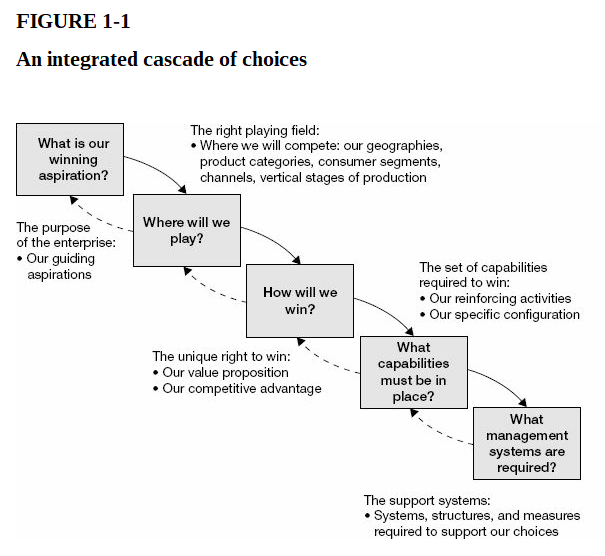

Note: Bài này để tóm tắt phần đầu của quyển "[Playing to Win: How Strategy Really Works](https://www.goodreads.com/book/show/13586928-playing-to-win)", tác giả A.G. Lafley và Roger L. Martin xuất bản lần đầu năm 2014. 

### Tại sao cậu lại có bài viết này?

Ở công ty "X" (hơn chục nghìn nhân viên, vài trăm triệu đô doanh thu) có cái hay là thỉnh thoảng được đọc những ghi chép cá nhân cực hay ho của một vài lãnh đạo về những vấn đề cực đao to búa lớn: giá trị công ty, tầm nhìn, chiến lược, v.v. Các anh chị đấy vẫn biết mình chưa đủ giỏi, vẫn biết mình còn phải đi học thêm các cao nhân, về nhà còn cặm cụi ghi chép lại để ai ai trong công ty cũng có thể học ít học nhiều từ đấy. Vậy thì một cá nhân nhỏ bé như tôi chẳng nhẽ lại coi những thứ đao to búa lớn ấy chẳng liên quan đến mình? 

Vậy thì nên quan tâm cái gì? Một khi đã làm trong lĩnh vực cung ứng dịch vụ, thì ai cũng nên có hiểu biết cơ bản về việc kinh doanh để có thể có một cuộc đối thoại tử tế với những người làm kinh doanh khác (khách hàng, cấp trên). Nghĩa là phải hiểu cách mà khách hàng (hoặc lãnh đạo công ty) đang nghĩ và tiếp cận công việc kinh doanh của họ (và của mình). Còn không, tự khắc ta sẽ mất điểm trong mắt đối tác, mất điểm thì còn làm ăn gì với nhau nữa?

Đó là lý do tôi đến với quyển "[Playing to Win: How Strategy Really Works](https://www.goodreads.com/book/show/13586928-playing-to-win)", được "sự phụ" của những lãnh đạo công ty tôi khuyên đọc. Điều làm tôi muốn đi tiếp sau khi đọc phần đầu, đó là vì tâm đắc với lời khuyên của tác giả rằng *cần đặt khách hàng lên đầu tiên trong suy nghĩ làm chiến lược, công việc của mình là để phục vụ khách hàng, chứ không phải để bán cái đang có cho khách*. Nghe sáo rỗng quá phải không?

### Thế strategy là cái gì?

- Ngắn gọn:
  - Strategy không phải là:
    - việc lập kế hoạch
    - quản lý
  - Strategy là một tập các lựa chọn để sao cho đã chơi là phải thắng.
  - Strategy là một tập các lựa chọn liên quan đến nhau, giúp định vị doanh nghiệp theo cách độc nhất trong lĩnh vực đang kinh doanh, tạo ra những lợi thế bền vững và giá trị vượt bậc so với các đối thủ cạnh tranh. 

- Để làm được strategy, doanh nghiệp cần trả lời năm câu hỏi liên quan chặt chẽ đến nhau như sau:
  - Câu 1: Tinh thần chơi là để thắng của anh là gì? Mục đích tồn tại của doanh nghiệp anh là gì?
  - Câu 2: Anh định chơi ở chiến trường nào để có thể đạt được mục đích nói trên?
  - Câu 3: Anh định làm thế nào để chiến thắng trên chiến trường đã chọn?
  - Câu 4: Anh cần có những năng lực gì để chiến thắng theo cách trên?
  - Câu 5: Anh cần có hệ thống quản lý như thế nào để thúc đẩy năng lực và hỗ trợ các quyết định?

  

### Xong rồi sao? cậu định làm gì với mớ định nghĩa trên?

Mớ định nghĩa trên có nhiều thứ quá, nhưng hãy bắt đầu với tinh thần "chơi là để thắng" cái đã!!!! 

Tôi đã có những chuyển dịch khác so với lúc đầu bước chân vào thế giới công nghệ, từ chỗ làm thuần (web) development, thử làm (technology/ solution) consultant, làm pre-sale tìm kiếm khách hàng cho các solutions của team mình. Tôi bắt đầu tin rằng "*nothing happens until someone sells something - Roger Looyenga, CEO*", và muốn (pre) sale được, bắt buộc phải hiểu khách hàng, phải nghĩ như khách hàng, phải nghĩ hộ khách hàng theo cách họ sẽ nghĩ. Muốn như thế, phải đặt khách hàng lên đầu trong suy nghĩ của mình về strategy, bán cho khách hàng thứ mình cần chứ không phải chỉ chăm chăm thứ mình có. Và bán để khách và mình cùng "win", chứ không phải bán chỉ để bán - khách hàng mua của mình cũng được, không mua cũng không sao. 

Ví dụ nhé: 
- Nếu hỏi một ông ABB làm máy biến áp mục đích kinh doanh của ông là gì, thì câu trả lời (có lẽ) nên là để giúp khách hàng ngành điện củng cố và tạo ra hệ thống hạ tầng với độ tin cậy cao khi truyền tải điện năng trên lưới, chứ mục đích kinh doanh không phải là bán thêm nhiều máy. 
- Nếu hỏi một ông FSOFT mảng Manufacturing mục đích kinh doanh của ông là gì, thì câu trả lời (có lẽ) nên là giúp khách hàng giải quyết các bài toán Quality & Cost & Delivery của nhà máy, chứ không phải là cung cấp các giải pháp MOM-MES.

Bằng cách hiểu được một phần trong mớ định nghĩa nói trên, cách thức tiếp cận khách hàng sẽ khác, khách hàng sẽ nhìn mình với ánh mắt khác. Lâu dài, nó sẽ tạo ra win-win cho cả hai bên. 

