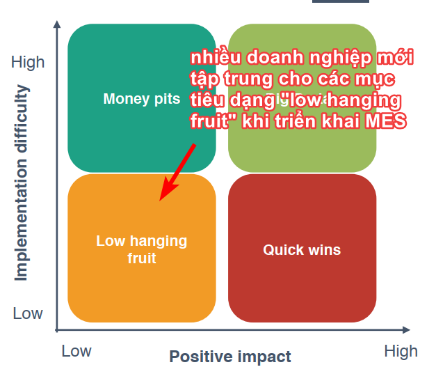

Series bài dịch về [MES](https://en.wikipedia.org/wiki/Manufacturing_execution_system) trong quá trình tìm hiểu về hệ thống này.

- Bài 1: [MES - Những bài học để thành công](https://travisnguyen.net/MES/2019/05/09/mes-failure-success/)
- Bài 2: [Vai trò của Center OF Excellence trong việc hiện thực hoá chuyển đổi hoạt động sản xuất](https://travisnguyen.net/MES/2019/05/10/mes-failure-success-2/)

Bài gốc "[The secret to MES success: Learn from experience](http://www.apriso.com/blog/2016/07/the-secret-to-mes-success-learn-from-experience/)" được viết bởi Darren Riley, một Business Solution Consultant của Apriso vào tháng 7 năm 2016.

=======

>- Có phải cứ triển khai [Manufacuturing Execution System (MES)](https://en.wikipedia.org/wiki/Manufacturing_execution_system) trong nhà máy là sẽ thành công?
>- Có case study nào từ những nhà máy thành công trong việc này? 
>- Có case study nào từ những công ty đã triển khai MES rồi thất bại?

Đây là những câu hỏi quan trọng mà bất kỳ giám đốc nhà máy nào đều nghĩ đến trước khi đầu tư vào hệ thống CNTT mà họ hy vọng sẽ giúp cải thiện lợi nhuận và chuỗi cung ứng (Supply Chain), và đưa doanh nghiệp gần hơn với cái gọi là "*Nhà máy Kỹ thuật số*" trong tương lai.

Để tìm câu trả lời cho những câu hỏi trên, [Gartner](https://en.wikipedia.org/wiki/Gartner) cùng với Hiệp hội Giải pháp Doanh nghiệp Sản xuất ([Manufacturing Enterprise Solutions Association - MESA](https://en.wikipedia.org/wiki/Manufacturing_Enterprise_Solutions_Association)) để khảo sát hơn 100 công ty sử dụng MES. Lưu ý là tất cả các công ty trong cuộc khảo sát đã thực sự triển khai MES, vì vậy ta có thể tin rằng thông tin họ cung cấp là hữu ích và mang tính thực tế.

## Kết quả khảo sát: Cả tin tốt lẫn xấu

- **Tin tốt**? là hầu hết các nhà sản xuất đều thu được lợi ích gì đó, với ROI đáng kể từ các khoản đầu tư MES của họ, đặc biệt là trong ngắn hạn. Ví dụ, nghiên cứu cho thấy 48% dự án MES giúp cải thiện chất lượng trong vòng 3 tháng và 80% trong một năm hoặc ít hơn.
- **Tin xấu**? Hầu hết các nhà sản xuất đều không đạt được tất cả những lợi ích mà họ mong đợi. Cụ thể?:
  - Hơn hai phần ba cho biết họ đạt được ít hơn 75% kết quả kinh doanh mong đợi
  - 31% đạt được chưa đến một nửa. 
  - Do đó, các công ty này đang gặp khó khăn trong cả việc lập kế hoạch cho giai đoạn tiếp theo cũng như nguồn tài trợ để tiếp tục chuyển đổi hoạt động sản xuất của họ.

Vậy "**behind the scence**" là gì? chuyện gì đang xảy ra?

## Trở ngại mà các doanh nghiệp sản xuất đang gặp phải? 

Các nhà sản xuất nhận ra vấn đề, ít nhất là ở một mức độ nào đó. Khi được hỏi về những vấn đề doanh nghiệp đã gặp phải, những thứ được liệt kê là: không hiểu đầy đủ về chi phí, business case, cũng như ROI của các khoản đầu tư cho MES.

Thật là ngạc nhiên! Làm thế nào một doanh nghiệp lại tiến hành đầu tư cho MES mà không hiểu đầy đủ về nó? Có ít nhất hai lý do.

1. **Một**: họ tiến hành làm những dự án dạng "low hanging fruit", tức là lợi ích ngắn, dễ làm, đem lại ROI nhanh chóng, ví dụ như trực quan hoá tình trạng kinh doanh & hoạt động sản xuất, chất lượng được cải thiện. Đây chính là lý do giải thích làn sóng đầu tiên ứng dụng MES của các doanh nghiệp. Sau đó thì các nhà sản xuất không thấy những busines case nào để làm tiếp nên dừng các giai đoạn sau của MES.

    Như lưu ý của bản phân tích khảo sát: *Tuy MES đem lại một vài lợi ích ngắn hạn, nhưng những cải tiến lâu dài (giảm chi phí lao động, cải thiện hàng tồn kho và dòng tiền) vẫn cần thời gian, cần sự tập trung dài hạn vào nguồn nhân lực, quy trình, cũng như công nghệ*.

2. **Hai**: Các doanh nghiệp phải vật lộn với công việc điều hành sản xuất vốn đã vô cùng phức tạp, khi đụng vào Enterprise MES thì đồng nghĩa đụng đến mọi hoạt động, từ quy trình, vật liệu và thiết bị, đến lập kế hoạch, con người và đối tác. Nghĩa là không chỉ là kế hoạch cài cắm phần mềm, mà còn là một chiến lược dài hạn để thay đổi và chuyển đổi những thứ khác.

## Bài học kinh nghiệm ở đây là gì?

1. **Bài học quan trọng nhất**: phạm vi của dự án phải được phân tích kỹ lưỡng. Tiêu chí gì để xác định "phạm vi của dự án"? cứ dựa vào "nhóm các giá trị" (value buckets) quan trọng và có ảnh hưởng nhất, nó sẽ là phương hướng để  công ty tập trung vào khi thực hiện một hệ thống MES. Hầu hết các nhà sản xuất nhìn vào khoảng 20 value buckets liên quan đến thành công ngắn hạn. Ngược lại, Dassault Systèmes DELMIA khuyên doanh nghiệp nên đánh giá hơn 75 lĩnh vực khi triển khai hệ thống MES để đảm bảo đạt được mục tiêu ngắn hạn và dài hạn.

2. **Bài học thứ hai**: việc triển khai MES thành công không chỉ bởi công nghệ ngon, mà còn do con người, do quy trình và chuyển đổi tổ chức. Hiểu được điều này, và cách thức giải quyết thì bạn đã nắm được chìa khóa thành công với MES.

    Gartner kết luận rằng các nhà sản xuất cần "*chuyển trọng tâm từ các dự án CNTT ưu tiên ROI ngắn hạn sang chiến lược cho hoạt động sản xuất*". Chiến lược này cần bao gồm quản lý triển khai MES về một nơi, có tầm nhìn bao quát về vai trò của MES với mục tiêu đạt được hợp tác tốt hơn trong chuỗi cung ứng.

## Kết luận

Trong quá trình hiện đại hóa, nhiều nhà sản xuất đang bỏ lỡ cơ hội để tạo ra những tác động đáng kể & lâu dài đối với tổ chức của họ. Thay vì đi một mình, hoặc xem MES như một ứng dụng có thể được triển khai đơn lẻ, các nhà sản xuất hãy tìm những đối tác với quy trình đã được kiểm chứng, có lộ trình rõ ràng khi bước vào khu rừng MES, có kế hoạch và chiến lược cụ thể để triển khai MES đem lại ROI như kỳ vọng.

Khi nhìn các bài toán kinh doanh rộng ra, với kỳ vọng về ROI cụ thể - đo lường được - kèm kế hoạch thực tế, các nhà sản xuất có thể thu về những lợi ích từ triển khai MES nhiều hơn trong khoảng thời gian ngắn hơn. Từ đó, nền tảng sản xuất kinh doanh, hợp tác trong chuỗi cung ứng, lợi nhuận và lợi thế cạnh tranh của doanh nghiệp được thiết lập vững chắc cho tương lai dài hạn.

## Tham khảo thêm

- [CENTER OF EXCELLENCE: Optimizing key step in realizing MES/MOM operational transformation](http://www.apriso.com/blog/2017/04/center-of-excellence-optimizing-key-step-in-realizing-mesmom-operational-transformation/)
- [The Financial Case for an Enterprise Platform for Manufacturing Operations Management](http://www.apriso.com/blog/2015/10/the-financial-case-for-an-enterprise-platform-for-manufacturing-operations-management/)
- [Is Bigger Better? How to Get More ROI on Manufacturing Machinery](http://www.apriso.com/blog/2015/08/the-bigger-the-better-how-to-get-more-roi-on-manufacturing-machinery/)
- [Top 10 ROI Metrics to Justify an EAM/CMMS](http://www.apriso.com/blog/2015/07/top-10-roi-metrics-to-justify-an-eamcmms/)
