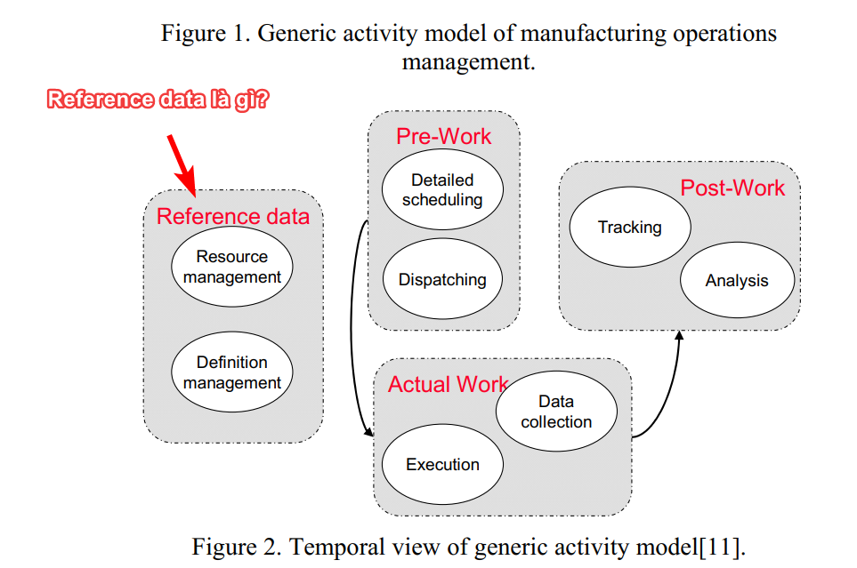

Data là chủ đề rất quan trọng khi xây dựng bất kỳ giải pháp phần mềm nào, nhưng nó lại khiến người không chuyên (thậm chí cả chuyên) nhầm lẫn giữa một loạt khái niệm, như phân biệt **master data**, **transaction data**, và **master data** chẳng hạng. Nhân khi đọc bài "*Guidelines for defining user requirement specifications (URS) of manufacturing execution system (MES) based on ISA-95 standard*" ([Lei Yue et al 2019 J. Phys.: Conf. Ser. 1168 032065](https://doi.org/10.1088/1742-6596/1168/3/032065)) nói về **reference data**, tôi thấy mình cần tìm hiểu và note lại vài mục để làm cơ sở cho các thảo luận nâng cao sau này. 

## 1. Reference data là gì:

### 1.1. [Theo wikipedia](https://en.wikipedia.org/wiki/Reference_data)

> **Đinh nghĩa**: Reference data are data that define the set of permissible values to be used by other data fields. Reference data gain in value when they are widely re-used and widely referenced. Typically, they do not change overly much in terms of definition, apart from occasional revisions. Reference data are often defined by standards organizations, such as country codes as defined in ISO 3166-1.

Ví dụ về reference data:
- Units of measurement
- Country codes
- Corporate codes
- Fixed conversion rates e.g., weight, temperature, and length
- Calendar structure and constraints

### 1.2. [Theo IBM Reference Data Management, Redbooks Solution Guide](http://www.redbooks.ibm.com/abstracts/tips1016.html):

> Reference data refers to data that is used to categorize other data within enterprise applications and databases. Reference data includes the lookup table and code table data that is found in virtually every enterprise application, such as country codes, currency codes, and industry codes.

> Reference data is distinct from transactional data and master data. Transactional data is the data that is produced by transactions within applications; master data is the data that represents the key business entities that participate within transactions. Reference data is also distinct from metadata, which describes the structure of an entity. Transactional data, master data, and reference data, when combined, comprise the key business data within an enterprise.

> Most enterprise applications contain reference data, built into code tables, to classify and categorize product information, customer information, and transaction data. Reference data changes relatively infrequently, but it does change over time, and given its ubiquity, synchronizing reference data values and managing changes across the enterprise is a major challenge (Figure 1).

### 1.3 [Theo lightsondata](https://www.lightsondata.com/reference-data-needs-standard-definition/)

> A set of permissible values associated with a distinct definition, used within a system or shared between multiple systems in an organization, domain or industry, which provides a standardized semantic to further categorize a data record.

## Năm (5) đặc tính của reference data

Theo [lightsondata](https://www.lightsondata.com/reference-data-needs-standard-definition/):

1. Nó không được tạo ra, hoặc được thay đổi thường xuyên như master data. Ví dụ như khi bạn load database table dữ liệu các loại tiền tệ trên thế giới, dữ liệu này sẽ ít khi thay đổi. Ví dụ về đồng tiền Euro: the “new” Euro currency became into effect on January 1st, 1999 and redemption after legal tender of the currency it replaced is considered indefinitely, in some cases, and in some cases they have an official date.

2. Nó được chia sẻ giữa nhiều hệ thống, cả trong lẫn ngoài doanh nghiệp. Ví dụ: danh sách các quốc gia trên thế giới, danh sách giới tính, mã mô tả dịch bệnh, đơn vị đo lường, HS code v.v.

3. Nó không được mô tả như là thứ mà doanh nghiệp đang có hoạt động kinh doanh trên đấy, mà thiên về cách doanh nghiệp phân loại các dữ liệu, các sản phẩm kinh doanh của mình. Ví dụ: chủng loại sản phẩm, trạng thái của đơn hàng, địa điểm của khách hàng, v.v.

4. Mỗi thành phần của reference data có định nghĩa riêng biệt. Ví dụ: danh sách phân loại một tổ chức có thể có là: corporation, foundation, government corporation, non-profit organization, v.v, mỗi cái có định nghĩa cụ thể riêng. 

5. Thường được định nghĩa bởi bên thứ 3 độc lập, như ISO, UN, WHO, v.v.

## Reference data có thể được phân vào 3 nhóm:

- Nhóm 1: Universal reference data (cả thế giới dùng)
- Nhóm 2: Industry reference data (dùng trong một nhóm ngành công nghiệp)
- Nhóm 3: Internal reference data (dùng nội bộ tập đoàn/ doanh nghiệp)

| Nhóm        | Một vài nhánh chính thống        | Các giá trị không đổi  | Types & Codes  |
| ------------- |:-------------:| -----:| -----:|
| Cả thế giới dùng     | [United Nations Standard Products and Services Code (UNSPSC)](https://en.wikipedia.org/wiki/UNSPSC) | Đơn vị đo lường |[WHO - International Classification of Diseases (ICD)](https://www.who.int/classifications/icd/factsheet/en/), [ISO - Country Currency Code](https://www.iban.com/currency-codes) |
| Trong 1 nhóm ngành công nghiệp      | [North American Industry Classification System](https://en.wikipedia.org/wiki/North_American_Industry_Classification_System)      | Biểu phí/ thuế | [United States Postal Service (USPS) cho địa chỉ phố](https://en.wikipedia.org/wiki/ZIP_Code) |
| Nội bộ tập đoàn/ doanh nghiệp | Danh sách các phòng ban      | Phân bố ngân sách, error margin| Transaction code & Status code |
