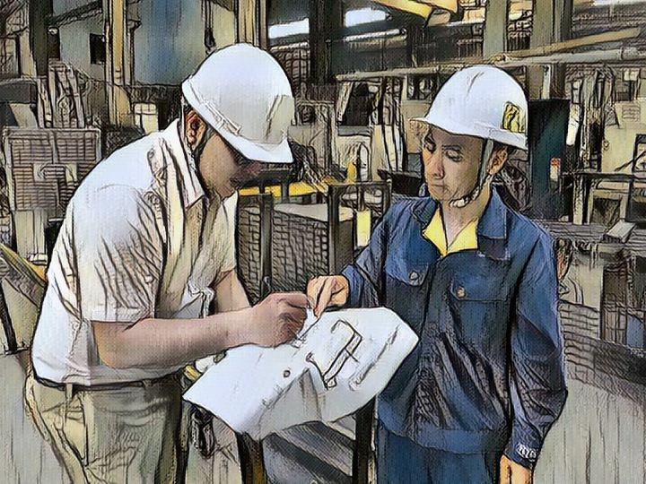

Ghi chép ngày 09.11.2019, sau buổi làm việc tại địa điểm của khách hàng (một nhà máy sản xuất thiết bị công nghiệp) cho dự án "*phát triển phần mềm quản lý tồn kho và quản lý sản xuất*".

> Làm việc với end-user trong công đoạn thiết kế phần mềm là khoảng thời gian tràn đầy cảm hứng. "Màu" của end-user ảnh hưởng đến toàn bộ suy nghĩ của người thiết kế. Trong ảnh là "màu xanh" của công nhân, những người trực tiếp sẽ sử dụng phần mềm do team viết. Màu xanh đồng nghĩa với những nơi sử dụng phần mềm (nhà xưởng) có thể bụi bặm, đồng nghĩa với những bàn tay đeo găng dính bụi dính dầu mỡ khi thao tác với thiết bị, đồng nghĩa với hạn chế về trình độ tin học, sự khéo léo nhanh nhạy thao tác trên màn hình, hạn chế khi thao tác với chuột, và còn nhiều thứ nữa.
>
> Vẻ đẹp ở đây là sự tỉ mỉ trong tưởng tượng: cấp độ tỉ mỉ tối thiểu phải ngang công việc mà khách đang làm: cần biết chính xác người dùng sẽ phải làm từng bước từng bước nhỏ như thế nào, tương tác với thiết bị nào, quần áo găng tay ra sao, di chuyển giữa các điểm nào trong xưởng, hay từ xưởng trở về văn phòng, khoảng cách bao lâu, v.v. Từ đấy hình dung mỗi bước hiện tại sẽ thay đổi thế nào trong tương lai, thêm hay bớt thao tác, thời gian, công sức, rủi ro, độ tiện lợi, độ an toàn?
>
>Cảm giác thứ mình "sẽ" xây dựng sẽ giúp "Kaizen" một phần công việc của một tập thể là thứ hạnh phúc rất dễ chịu, xứng đáng cho những ngày lang thang nhà máy ăn cơm công nhân chẳng sang chảnh.

