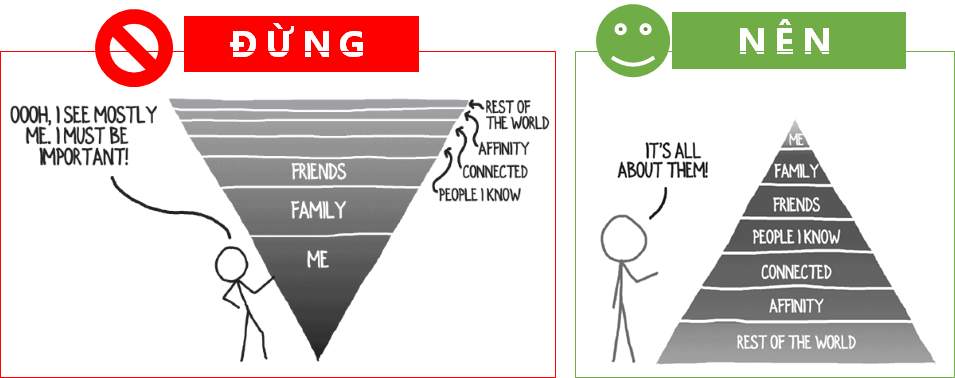
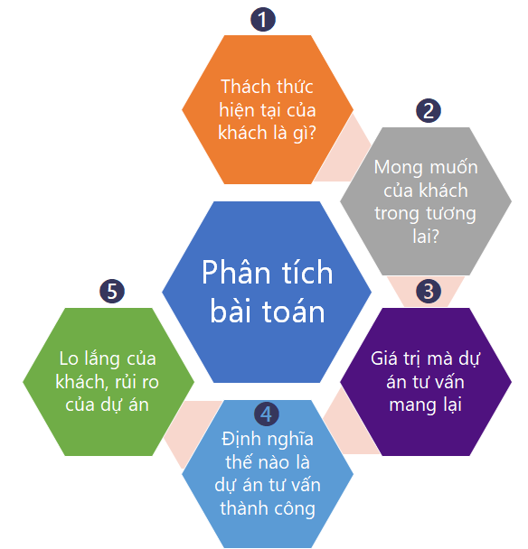

Những ngày tháng cuối năm 2019 bỗng dưng được khai sáng về công việc của Consulting/ Sales Engineer, công việc mà tôi đã loay hoay làm từ tháng 2, khi theo các anh em khác vào Sài Gòn cho 1 dự án về Cảng/ Logistics. Một trong những điều "thiệt thòi" (?) là không được học về tư vấn một cách bài bản trong các cty consulting (như McKinsey, BCG, Big4, etc.). Tuy vậy, đã có hàng nghìn hàng trăm nghìn người trên thế giới đang tiến vào con đường này, cũng bắt đầu chập chững, và rồi thành công ở mức độ nào đó. Vậy tại sao tôi thì không? Thứ có thể guide những người mới vào ngành như tôi, ngoài học hỏi từ những senior đi trước, thì còn có thể tham khảo từ sách. Dưới đây là hai quyển đã giúp tôi "ngộ" ra quá nhiều điều sau 2 - 3 ngày đọc. 

Quyển "[The Irresistible Consultant's Guide to Winning Clients: 6 Steps to Unlimited Clients & Financial Freedom](https://www.amazon.com/Irresistible-Consultants-Guide-Winning-Clients/dp/1683501640)" của David A. Fields xuất bản năm 2017:
- Điểm nhấn quan trọng nhất và đầu tiên mà David đề cập, đó là thay đổi cách nghĩ từ việc "**đặt bản thân là trung tâm giải quyết vấn đề của khách**" sang thành "**đặt vấn đề của khách thành trung tâm để đi tìm cách giải**".
- Từ việc thay đổi perspective đó, tác giả bắt đầu dẫn dắt cách một "aspiring consultant" phân tích vấn đề của khách hàng rất chi tiết trước khi đi tạo proposal. 
- Ngoài việc phân tích quá trình xây dựng consulting business, tác giả còn cung cấp nhiều template để độc giả có thể sử dụng và thực hành luôn.
- Rất nhiều lời khuyên trong khách rất thực tiễn, cực kỳ cụ thể, chứ không khuyên chung chung như kha khá các tác giả sách khác.

*Phân tích bài toán?*

Quyển "[Mastering Technical Sales: The Sales Engineer's Handbook (Artech House Technology Management Library)](https://www.amazon.com/Mastering-Technical-Sales-Professional-Development/dp/1608077446/ref=pd_sbs_14_t_0/142-5189973-2296546?_encoding=UTF8&pd_rd_i=1608077446&pd_rd_r=efd623bd-3395-46bd-8c6a-4e33f5cdc50b&pd_rd_w=WZzvJ&pd_rd_wg=BQZqB&pf_rd_p=5cfcfe89-300f-47d2-b1ad-a4e27203a02a&pf_rd_r=ANXVBAZMT0F4G91ENB5D&psc=1&refRID=ANXVBAZMT0F4G91ENB5D)" của  John Care B.S và Aron Bohlig xuất bản năm 2014. Tôi biết về quyển này sau khi học xong khoá "[Technical Sales: The Role of the Sales Engineer](https://www.linkedin.com/learning/technical-sales-the-role-of-the-sales-engineer)" của John Care trên LinkedIn Learning. Quyển sách này gần 400 trang, và tôi mới chỉ đọc được 1 trong 3 chương mà tác giả khuyên (dành cho Sales Engineer mới vào nghề).
- Sẽ có người hỏi tại sao đang "Consultant" lại thành "Sales Engineer"? Có lẽ ở Việt Nam, có lẽ ở vị trí của tôi hiện tại, khó mà rạch ròi giữa hai việc này. 
  - Sales Engineer vừa làm việc tư vấn cho khách, define bài toán cho khách.
  - Consultant vừa phải đi tư vấn, tìm cách bán một lượng nhất định sản phẩm/ con người của team của mình vào dự án triển khai (nếu thực sự phù hợp).
  - Rất khó để không biased. Thôi cố gắng "trung lập" nhất có thể. 
- Lời khuyên của John Care cũng cực kỳ chi tiết. Lần đầu tiên tôi biết đến sales process nói chung, và vị trí/ vai trò của sales engineer trong cái process này. Để từ đó biết chỗ nào mình có thể thả lỏng, chỗ nào cần tập trung. Phần nào John đề cập cũng được rút ra từ kinh nghiệm xương máu từ các dự án tư vấn kỹ thuật cho bán hàng trước đó. 

Ngoài ra còn một số quyễn nữa cũng có hữu ích ở những khía cạnh nào đó, sẽ được chia sẻ trong những bài tiếp theo.
