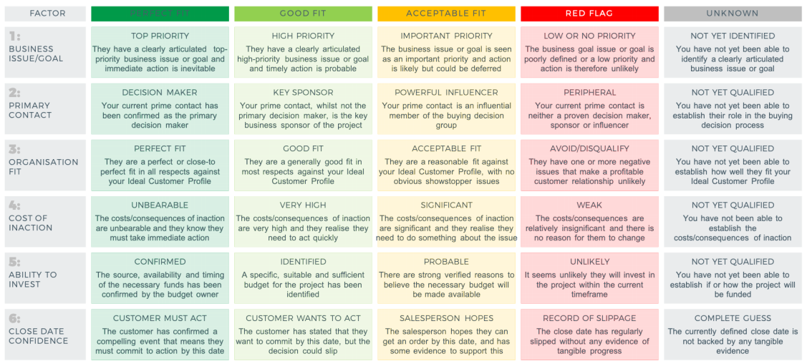

Trong bài "[Làm sao để hiểu khách hàng](https://travisnguyen.net/pre_sales/2020/04/26/the-best-way-to-understand-your-customer/)", việc lắng nghe để hiểu nhu cầu của khách nên là một mối bận tâm lớn của bất kỳ người nào làm "front". Nhưng khách hàng cần người nghe mình, sau đó "bán cho họ" thứ gì có thể giúp họ, đúng thứ họ đang cần, đem lại giá trị cho business của khách hàng. Trong bài "[This is why (some) B2B customers are still buying in the current climate...](https://www.inflexion-point.com/blog/this-is-why-some-b2b-customers-are-still-buying-in-the-current-climate)" viết tháng Năm 2020, Bob Apollo đã nói về điều này một cách ngắn gọn "*selling what customers are buying*".

 - Vấn đề cốt lõi trong business của khách hàng, vấn đề họ đang ưu tiên giải quyết phải được xác định và trở thành đích đến của bên cung cấp dịch vụ. Cần tìm xem "[Minimum viable problem](https://www.inflexion-point.com/blog/what-is-your-customers-minimum-viable-problem)" của khách là gì? Hãy bỏ qua ham muốn thực hiện dự án đầu tiên to hơn cần thiết (lớn hơn nhu cầu của khách). 
- Khách hàng đang có băn khoăn gì về proposal? tại sao họ chưa chấp nhận? outcomes mong muốn của khách đã trùng với kết quả dự án nhắc đến trong proposal hay chưa? 

Để đánh giá xem proposal đã thực sự hướng đến thứ khách hàng cần hay chua, Bob Apollo cũng đưa ra những hướng dẫn cụ thể hơn. Hình dưới đây là một trong các ví dụ mà ông nhắc đến trong guideline của mình:

Ghi chú nhanh: Bài viết về "*Minimum viable problem*" có thể đọc ở [đây](https://www.inflexion-point.com/blog/what-is-your-customers-minimum-viable-problem). Nôm na thì:
- "*Minimum viable product*" phổ biến trong giới startup, liên quan đến việc phát hành những sản phẩm có những tính năng vừa đủ đáp ứng nhu cầu đầu tiên của khách hàng, nhằm đón nhận phản hồi sớm nhất có thể. 
- "*Minimum Viable Problem* lại là việc của khách hàng, liên quan đến một vấn đề/ cơ hội/ mối đe doạ trong việc sản xuất kinh doanh của khách. Vấn đề/ cơ hội/ mối đe doạ này đủ quan trọng để khách cân nhắc đối sách xử lý, nhưng cũng phải nằm trong tầm kiểm soát để họ có thể đưa ra quyết định làm việc với 1 giải pháp nào đó trên thị trường. 

Trung Nguyễn 
Hanoi. 16.05.2020