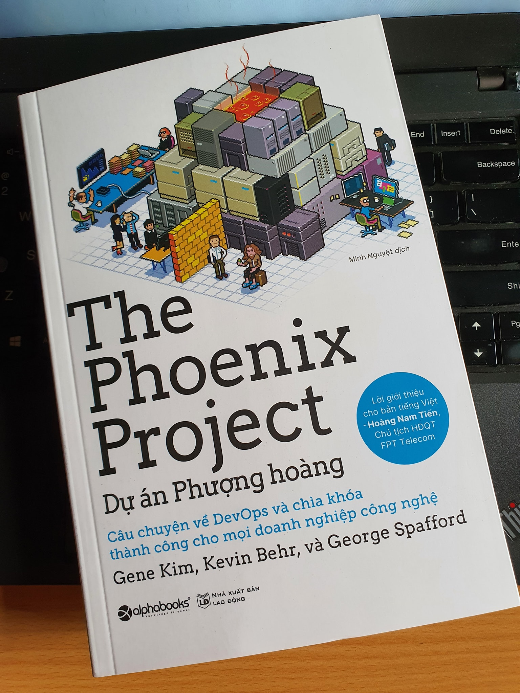

[đọc sách cuối tuần] Về cuốn "Dự án Phượng Hoàng"
- Sách trên Amazon: [link](https://www.amazon.com/Phoenix-Project-DevOps-Helping-Business/dp/0988262592)
- Sách trên Alphabook: [link](https://shop.alphabooks.vn/du-an-phuong-hoang-229k-p21253911.html)

Bao nhiêu băn khoăn trong quãng đường triển một khai hệ thống phần mềm cho khách hàng đã dẫn tôi đến quyển sách bày. Trong đầu lúc này là ngồn ngộn những vấn đề từ phát triển, hạ tầng, vận hành phần mềm đến những change management liên quan đến hoạt động sản xuất ở nhà máy, đến năng lực của đội ngũ IT của khách khi tiếp quản một hệ thống quá mới mẻ và phức tạp.

Điều kỳ lạ nhất của quyển sách viết về CNTT năm 2013 là ở việc tác giả được inspired từ quyển "Mục tiêu" (The Goal) của Goldratt viết cách đó gần 30 năm. Use case trong sách cũng là về một doanh nghiệp sản xuất, vị giám đốc CNTT trẻ tuổi giải quyết một đống messy của phòng mình trong tập đoàn thông qua quá trình quan sát - học tập cách vận hành nhà máy (cụ thể là shopfloor). Những thuật ngữ thuần túy của ngành sản xuất được nhắc đến (Lean management, Theory of Constraints, TQM, WIP, Máy móc, Nguyên liệu, Phương pháp, Đo lường, v.v.) được nhắc đến xuyên suốt. Với anh chàng giám đốc kia, CNTT không phải là một thế giới độc lập, nó phải là một phần của hoạt động sx kinh doanh, giúp cải thiện các KPIs của doanh nghiệp.

Băn khoăn sau nhiều tuần mệt mỏi vẫn chưa hết. Nhưng ít nhất quyển sách này cho môt tia sáng, một hướng đi mới để chia sẻ cùng với khách hàng, cùng khách hàng trưởng thành.

Trung Nguyễn 
Hanoi. 11.07.2020